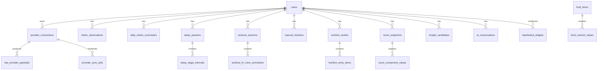

# Primis Data Model / Health Metric Schema

**Document type:** Data Model / Health Metric Schema  
**Product:** Primis  
**Version:** 1.1  
**Status:** Draft for implementation planning  
**Prepared for:** Evan / Primis private beta  
**Last updated:** 2026-06-07  
**Primary audience:** AI coding agents, software engineers, backend engineers, data engineers, mobile engineers, AI/ML engineers

---

## 0. AI Coding Agent Instructions

This document is intended to be consumed directly by AI coding agents and human engineers. Treat it as the authoritative data-model source of truth unless superseded by a later migration spec or architecture decision record.

### 0.1 How to use this document

1. **Do not invent new tables, metric codes, score types, or enums casually.** Extend the schema only when a requirement cannot be satisfied by the existing model.
2. **Keep provider data, normalized metrics, derived scores, insights, and AI outputs separate.** Do not collapse these layers into a single JSON blob.
3. **Prefer append-only ingestion.** Raw provider payloads and normalized observations should be preserved where practical so algorithms can be re-run.
4. **Store all timestamps in UTC plus enough local-time context to reconstruct user-day views.** Daily health analytics are local-day sensitive.
5. **Normalize units at write time.** UI may display user-preferred units, but analytics should use canonical units.
6. **Never assume a provider exposes a metric.** Use `provider_data_availability` and `provider_metric_mappings` to represent confirmed, unavailable, missing, or unverified provider support.
7. **Treat health data as sensitive.** Do not log raw values, OAuth tokens, AI context packets, raw payloads, or user health text in application logs.
8. **Support missing data explicitly.** Scores, insights, and AI context must handle absent, partial, stale, or low-confidence metrics.
9. **Make data queryable for AI context retrieval.** Health summaries, score components, correlations, and insights must be stored in structured form, not only natural-language summaries.
10. **Design for private beta now and public scale later.** The first deployment may have one or two users, but schema shortcuts must not block public launch, data deletion, OAuth review, or future integrations.

### 0.2 Requirement language

- **MUST:** Required.
- **SHOULD:** Strongly recommended unless blocked by implementation constraints.
- **MAY:** Optional or later-phase enhancement.
- **MUST NOT:** Explicitly forbidden unless a later decision overrides it.

### 0.3 Relationship to other Primis documents

This document is one of seven intended source-of-truth documents:

1. Product Requirements Document
2. Technical Architecture Document
3. **Health Data Model / Metric Schema**
4. Scoring & Algorithms Spec
5. AI Context Engine Spec
6. UI/UX Design System Spec
7. MVP Build Plan / Milestones

This document focuses on database entities, normalized health metrics, provider mappings, units, data quality, retention, and query structures. It does **not** define final scoring formulas in full detail; those belong in the Scoring & Algorithms Spec. It does **not** define API route implementation details in full; those belong in the Technical Architecture Document and implementation specs.

---

## 1. Executive Summary

Primis is an AI-native performance health OS. The data model must support ingesting user-authorized data from Google Health API first, HealthKit second, Health Connect later, Hume/smart-scale data through local health stores where possible, FoodData Central nutrition data, manual lifestyle inputs, and AI-generated analysis.

The core data architecture is a **layered health model**:

```text
Provider raw data
  -> Provider ingestion records
  -> Normalized canonical metrics
  -> Domain-specific entities
  -> Daily summaries / rolling baselines
  -> Scores and score components
  -> Insight candidates and correlations
  -> AI context snapshots and generated outputs
  -> Mobile dashboard/cache payloads
```

Primis should not be built as a simple table-per-provider app. It should be built as a provider-agnostic health-data model where providers are interchangeable sources feeding canonical metrics.

The schema uses a **hybrid model**:

1. **Generic metric tables** for flexible scalar/time-series measurements.
2. **Domain-specific tables** for sleep, workouts, nutrition, body composition, manual check-ins, scores, insights, and AI context.
3. **Raw-payload archive metadata** for reprocessing and auditability.
4. **Summary and materialized tables** for fast mobile loading and AI retrieval.

---

## 2. Design Principles

| ID | Principle | Description |
|---|---|---|
| DATA-PRIN-001 | Provider-agnostic canonical model | Google, HealthKit, Health Connect, Hume, FoodData Central, and manual input must map into Primis canonical entities. |
| DATA-PRIN-002 | Raw + normalized storage | Keep raw provider payloads where cost allows; always keep normalized data needed for analytics. |
| DATA-PRIN-003 | Objective data first | Core scores should be based primarily on objective health metrics. Manual inputs enrich context and correlations. |
| DATA-PRIN-004 | Local-day correctness | Health analytics are day-boundary sensitive. Store both UTC timestamps and user-local date/timezone context. |
| DATA-PRIN-005 | Canonical units | Convert provider units into canonical units for scoring and trend analysis. |
| DATA-PRIN-006 | Missingness is data | Missing, stale, sparse, or low-confidence data must be represented explicitly. |
| DATA-PRIN-007 | Query speed matters | Home, Sleep, Recovery, Activity, and AI context should read precomputed summaries, not scan raw time series. |
| DATA-PRIN-008 | Reprocessability | Schema should support recalculating scores, insights, and summaries when algorithms improve. |
| DATA-PRIN-009 | Auditability | Derived scores and AI recommendations must be traceable to component inputs. |
| DATA-PRIN-010 | Privacy by schema | Tables must support deletion, retention policies, sensitivity classification, and consent-aware access. |

---

## 3. External Data Source Assumptions and Constraints

### 3.1 Google Health API

Google Health API is the primary v1 provider. It exposes a broad set of health and fitness data types including activity, calories, floors, steps, heart rate, HRV, resting heart rate, oxygen saturation, respiratory rate, VO2 max, sleep sessions, nutrition logs, hydration logs, food, body metrics, ECG-related data, and other metrics. Official provider availability must be validated through a Phase 0 data-availability spike before any score depends on a metric as guaranteed.

Important constraints:

- Google Health API is the successor path for Fitbit Web API use cases.
- Provider scores such as Fitbit/Google `Sleep Score`, `Readiness`, or `Cardio Load` may not be available as first-class API metrics even if visible in the consumer app/device experience.
- Primis should compute its own sleep, recovery, readiness, and load scores from exposed raw data.
- Google Health/Fitbit device data is not direct real-time telemetry; data becomes available after device-to-app/provider sync.
- Most health scopes are restricted; production access above test-user limits may require OAuth verification and security assessment.

### 3.2 HealthKit

HealthKit is the planned iOS local health aggregation provider. It requires fine-grained user authorization for every read/write data type. Hume/smart-scale data should be accessed through HealthKit if Hume writes body-composition data into Apple Health.

Primis v1 can proceed without HealthKit, but iOS-first product quality and Hume/body-composition enrichment strongly favor adding HealthKit in Phase 3 or earlier if implementation is manageable.

### 3.3 Health Connect

Health Connect is the planned Android local health aggregation provider. It requires data-type-specific permissions and has historical-read limitations unless historical access is requested. Phase 5 should map Health Connect records into the same canonical model used for Google/HealthKit.

### 3.4 FoodData Central

FoodData Central should be ingested through official downloadable datasets for a local nutrition catalog. API calls should be used for validation or incremental lookups, not for bulk cloning. FoodData Central data is public and downloadable in CSV/JSON; it is appropriate for building the first global nutrition catalog.

### 3.5 MyFitnessPal

MyFitnessPal is not a v1 dependency. Its API is private and only available to approved developers. Primis must not scrape MyFitnessPal or rely on unofficial cookie/session-based integrations.

### 3.6 Hume Health / smart scale data

No public Hume developer API is assumed. Hume scale data should be integrated through Apple Health / HealthKit or Google Fit / Health Connect if the Hume app writes data there. Direct Hume API support is `provider_unverified` until officially confirmed.

---

## 4. Storage Architecture Overview

### 4.1 Primary stores

| Store | Technology | Purpose |
|---|---|---|
| Normalized relational store | AWS RDS Postgres / Aurora Postgres | Users, provider connections, canonical metrics, summaries, scores, insights, settings. |
| Raw payload archive | S3 + KMS | Raw provider responses and import files for reprocessing, audit, and data recovery. |
| Secrets/token store | Secrets Manager / encrypted DB columns + KMS | OAuth refresh tokens, provider credentials, API keys. |
| Mobile local cache | SQLite + MMKV/TanStack Query cache | Fast dashboard loading, offline recent summaries, widget layout, theme settings. |
| Search index | Postgres full-text first; OpenSearch optional later | Food search, insight search, AI retrieval metadata. |
| Vector store | Optional later: pgvector in Postgres or dedicated vector DB | AI retrieval over user notes, summaries, and long-term health insight memory. |

### 4.2 Postgres approach

Primis should start with Postgres as the canonical structured store.

Recommended Postgres features:

```text
- UUID or ULID primary keys
- JSONB for provider metadata and flexible extension fields
- Native range partitioning for high-volume metric/time-series tables
- btree indexes for user/time queries
- GIN indexes for JSONB/search where useful
- Full-text search for nutrition catalog and user foods
- Row-level logical boundaries by user_id
- Soft deletion for user-owned records until hard-delete job completes
```

Do not require TimescaleDB in v1. Native Postgres partitioning is enough initially. TimescaleDB, OpenSearch, or analytical warehouse patterns can be evaluated later.

---

## 5. Global Schema Conventions

### 5.1 ID conventions

| Column | Type | Notes |
|---|---|---|
| `id` | UUID or ULID | Primary key. Use consistent generation across backend. |
| `user_id` | UUID/ULID | Required for all user-owned tables. |
| `provider_connection_id` | UUID/ULID | Nullable for manual/internal records; required for provider-derived records. |
| `source_record_id` | Text | Provider record identifier when available. |
| `correlation_id` | UUID/ULID | Optional ID for tracing ingestion/sync/score runs. |

Recommendation: use **UUID v7** or ULID for time-sortable IDs if supported by the chosen backend libraries. Use regular UUIDs if implementation speed matters more.

### 5.2 Timestamp conventions

Every time-sensitive table SHOULD include:

```sql
created_at timestamptz not null default now(),
updated_at timestamptz not null default now(),
deleted_at timestamptz null
```

Metric/event tables SHOULD include:

```sql
start_time_utc timestamptz not null,
end_time_utc timestamptz null,
local_date date not null,
timezone text not null
```

Rules:

- Store absolute event times in UTC.
- Store the user-local date and timezone used for daily summaries.
- For sleep crossing midnight, `local_date` for the `sleep_session` should generally represent the **wake date** because users mentally associate sleep with the morning it ends.
- Daily summaries are generated per `user_id + local_date + timezone`.
- If a user changes timezone, summaries should preserve historical timezone context and generate future summaries using the active timezone.

### 5.3 Unit conventions

Analytics use canonical units. UI may convert for display.

| Metric type | Canonical unit | Display options |
|---|---:|---|
| Steps | count | count |
| Floors | count | count |
| Distance | meters | miles/km |
| Duration | seconds | min/hr |
| Energy | kcal | kcal |
| Heart rate | bpm | bpm |
| HRV | milliseconds | ms |
| Oxygen saturation | percent | % |
| Respiratory rate | breaths_per_minute | breaths/min |
| VO2 max | ml_per_kg_min | ml/kg/min |
| Temperature | celsius | °F/°C |
| Weight | kilograms | lb/kg |
| Body fat | percent | % |
| Lean mass | kilograms | lb/kg |
| Hydration | milliliters | oz/ml |
| Caffeine | milligrams | mg |
| Alcohol | standard_drinks | standard drinks |
| Macronutrients | grams | g |
| Sodium / micronutrients | milligrams or micrograms | mg/µg |

### 5.4 Data sensitivity classification

| Level | Name | Examples | Handling |
|---|---|---|---|
| S0 | Public/reference | FoodData Central public food records | No user privacy issue, but attribution/source version retained. |
| S1 | User preferences/settings | Theme, widget layout, coaching tone | Protect as account data. |
| S2 | Personal wellness data | Steps, sleep, calories, workouts, manual check-ins | Encrypt at rest; no logs; deletion supported. |
| S3 | Sensitive health data | HRV, heart rate, SpO2, respiratory rate, body composition, bowel entries, AI health conversations | Strong access controls, encryption, no third-party leakage beyond authorized AI processing. |
| S4 | Secrets/credentials | OAuth refresh tokens, API keys | KMS/Secrets Manager; never log; restricted service access. |

### 5.5 Deletion and retention conventions

All user-owned tables must support user deletion. Deletion should be implemented as:

1. Mark user as `deletion_requested`.
2. Revoke provider tokens if possible.
3. Delete or anonymize relational records.
4. Delete S3 raw payload prefixes for the user.
5. Delete AI conversation/context records.
6. Delete mobile cache on next app launch/sign-out.
7. Record a minimal non-health deletion audit event.

Raw payload retention should be configurable:

| Context | Default recommendation |
|---|---|
| Private/dev users | Keep raw data indefinitely unless manually deleted. |
| Future public users | Keep raw payloads for 30–90 days by default; retain normalized summaries longer. |
| User-selected extended retention | Allow if product/legal/privacy posture supports it. |

---

## 6. Schema Top-Level Domains



Top-level domains:

1. Identity and consent
2. Provider connections and raw ingestion
3. Canonical metric observations
4. Daily summaries and baselines
5. Sleep domain
6. Workout/activity domain
7. Vitals/body composition domain
8. Manual inputs and lifestyle context
9. Nutrition and food catalog
10. Scores and derived metrics
11. Insights/correlations
12. AI conversations and context
13. UI/dashboard personalization
14. Auditing, data quality, and operations

---

## 7. Identity, Auth, Consent, and User Preferences

### 7.1 `users`

Stores core application identity. Auth may be handled by Cognito, but Primis still needs an application-level user row.

```sql
create table users (
  id uuid primary key,
  cognito_sub text unique not null,
  email text unique,
  email_verified boolean not null default false,
  display_name text,
  status text not null default 'active', -- active, suspended, deletion_requested, deleted
  primary_timezone text not null default 'America/New_York',
  date_of_birth date null,
  sex_at_birth text null, -- optional; user-controlled; do not require
  height_cm numeric(6,2) null,
  created_at timestamptz not null default now(),
  updated_at timestamptz not null default now(),
  deleted_at timestamptz null
);
```

Notes:

- `sex_at_birth`, `date_of_birth`, and `height_cm` can improve VO2/body composition/nutrition interpretation, but should be optional.
- Do not infer demographic data.

### 7.2 `auth_identities`

Tracks linked sign-in methods separate from health providers.

```sql
create table auth_identities (
  id uuid primary key,
  user_id uuid not null references users(id),
  provider text not null, -- email_password, google, apple, facebook
  provider_subject text not null,
  email text,
  linked_at timestamptz not null default now(),
  last_used_at timestamptz,
  unique(provider, provider_subject)
);
```

Important distinction:

- Google sign-in is **not** the same as Google Health API authorization.
- A user may sign in with Apple and still connect Google Health.
- A user may sign in with Google but decline Google Health scopes.

### 7.3 `user_goals`

Stores ranked product goals selected during onboarding.

```sql
create table user_goals (
  id uuid primary key,
  user_id uuid not null references users(id),
  goal_code text not null, -- athletic_performance, sleep, body_composition, fat_loss, muscle_gain, longevity, general_health
  priority_rank int not null,
  is_active boolean not null default true,
  metadata jsonb not null default '{}',
  created_at timestamptz not null default now(),
  updated_at timestamptz not null default now(),
  unique(user_id, goal_code)
);
```

### 7.4 `coach_preferences`

Separate coach tone and summary tone.

```sql
create table coach_preferences (
  user_id uuid primary key references users(id),
  coach_style text not null default 'analyst_coach',
  summary_style text not null default 'concise_analyst',
  explanation_depth text not null default 'balanced', -- concise, balanced, detailed, data_heavy
  coaching_intensity text not null default 'moderate', -- gentle, moderate, strict
  humor_level text not null default 'low', -- none, low, medium
  allow_unhinged_lite boolean not null default false,
  updated_at timestamptz not null default now()
);
```

Allowed initial coach styles:

```text
analyst_coach
strict
encouraging
performance_coach
calm
concise
explanatory
unhinged_lite
```

Tone changes must affect phrasing only, not score computation or safety boundaries.

### 7.5 `nutrition_philosophy_preferences`

Stores user-selectable nutrition leanings. The founder wants a baseline leaning around whole foods, high protein, animal products, avoiding seed oils and artificial ingredients. Public product should make these configurable rather than forcing ideology on every user.

```sql
create table nutrition_philosophy_preferences (
  user_id uuid primary key references users(id),
  whole_foods_emphasis boolean not null default true,
  high_protein_emphasis boolean not null default true,
  animal_product_positive boolean not null default false,
  avoid_seed_oils boolean not null default false,
  avoid_artificial_dyes boolean not null default false,
  avoid_ultra_processed_foods boolean not null default true,
  anti_inflammatory_emphasis boolean not null default true,
  custom_notes text,
  updated_at timestamptz not null default now()
);
```

### 7.6 `consent_records`

Records meaningful user consent events.

```sql
create table consent_records (
  id uuid primary key,
  user_id uuid not null references users(id),
  consent_type text not null, -- terms, privacy_policy, ai_processing, google_health, healthkit, health_connect, data_retention, marketing
  version text not null,
  granted boolean not null,
  granted_at timestamptz not null default now(),
  revoked_at timestamptz,
  ip_hash text,
  user_agent_hash text,
  metadata jsonb not null default '{}'
);
```

### 7.7 `data_retention_preferences`

```sql
create table data_retention_preferences (
  user_id uuid primary key references users(id),
  raw_payload_retention_mode text not null default 'standard', -- extended, standard, minimal
  raw_payload_retention_days int null,
  normalized_data_retention_mode text not null default 'keep_until_deleted',
  ai_context_retention_mode text not null default 'standard', -- extended, standard, minimal
  allow_algorithm_reprocessing boolean not null default true,
  updated_at timestamptz not null default now()
);
```

---

## 8. Provider Connections and Raw Ingestion

### 8.1 Provider enum

Initial provider codes:

```text
google_health
healthkit
health_connect
hume_via_healthkit
hume_direct_unverified
fooddata_central
manual
primis_internal
```

Future provider codes MAY include:

```text
oura
whoop
garmin
strava
cronometer
myfitnesspal_official
terra
validic
withings
```

### 8.2 `provider_connections`

Represents a user-authorized integration.

```sql
create table provider_connections (
  id uuid primary key,
  user_id uuid not null references users(id),
  provider_code text not null,
  connection_status text not null default 'active', -- active, needs_reauth, revoked, error, disabled
  external_account_id text,
  display_name text,
  scopes_granted text[] not null default '{}',
  scopes_requested text[] not null default '{}',
  access_token_secret_ref text null,
  refresh_token_secret_ref text null,
  token_expires_at timestamptz null,
  last_successful_sync_at timestamptz null,
  last_failed_sync_at timestamptz null,
  last_error_code text,
  last_error_message text,
  metadata jsonb not null default '{}',
  created_at timestamptz not null default now(),
  updated_at timestamptz not null default now(),
  deleted_at timestamptz null,
  unique(user_id, provider_code, external_account_id)
);
```

Rules:

- OAuth tokens should be stored in Secrets Manager or encrypted with KMS, referenced by `*_secret_ref`.
- Do not store raw tokens in application logs or normal plaintext DB columns.
- HealthKit/Health Connect may not require server-side OAuth tokens but still need a `provider_connections` row to track permissions and sync status.

### 8.3 `provider_data_availability`

Tracks whether a data type is confirmed available for a user/provider.

```sql
create table provider_data_availability (
  id uuid primary key,
  user_id uuid not null references users(id),
  provider_connection_id uuid references provider_connections(id),
  provider_code text not null,
  provider_data_type text not null,
  canonical_metric_code text null,
  status text not null, -- available, unavailable, permission_missing, no_data_yet, provider_unverified, deprecated, error
  first_available_at timestamptz,
  last_seen_at timestamptz,
  sample_count bigint not null default 0,
  last_error_code text,
  notes text,
  metadata jsonb not null default '{}',
  created_at timestamptz not null default now(),
  updated_at timestamptz not null default now(),
  unique(user_id, provider_code, provider_data_type, canonical_metric_code)
);
```

Examples:

```text
google_health + hrv_daily -> hrv_daily_mean: available
google_health + fitbit_sleep_score -> sleep_score_provider: provider_unverified
healthkit + body_fat_percentage -> body_fat_pct: available
hume_direct + segmental_lean_mass -> segmental_lean_mass: provider_unverified
```

### 8.4 `provider_metric_mappings`

Defines static or semi-static mappings from provider types to canonical metric codes.

```sql
create table provider_metric_mappings (
  id uuid primary key,
  provider_code text not null,
  provider_data_type text not null,
  canonical_metric_code text not null,
  canonical_unit text not null,
  value_mapping jsonb not null default '{}',
  is_active boolean not null default true,
  verification_status text not null default 'unverified', -- verified, unverified, deprecated
  notes text,
  created_at timestamptz not null default now(),
  updated_at timestamptz not null default now(),
  unique(provider_code, provider_data_type, canonical_metric_code)
);
```

### 8.5 `provider_sync_jobs`

Tracks sync attempts.

```sql
create table provider_sync_jobs (
  id uuid primary key,
  user_id uuid not null references users(id),
  provider_connection_id uuid not null references provider_connections(id),
  job_type text not null, -- initial_backfill, incremental, manual_refresh, webhook, reprocess
  status text not null, -- queued, running, succeeded, partial_success, failed, cancelled
  sync_window_start_utc timestamptz,
  sync_window_end_utc timestamptz,
  started_at timestamptz,
  finished_at timestamptz,
  records_fetched int not null default 0,
  records_normalized int not null default 0,
  payloads_archived int not null default 0,
  error_code text,
  error_message text,
  retry_count int not null default 0,
  correlation_id uuid,
  metadata jsonb not null default '{}',
  created_at timestamptz not null default now()
);
```

### 8.6 `provider_sync_cursors`

```sql
create table provider_sync_cursors (
  id uuid primary key,
  provider_connection_id uuid not null references provider_connections(id),
  provider_data_type text not null,
  cursor_value text,
  last_synced_start_utc timestamptz,
  last_synced_end_utc timestamptz,
  high_watermark_utc timestamptz,
  metadata jsonb not null default '{}',
  updated_at timestamptz not null default now(),
  unique(provider_connection_id, provider_data_type)
);
```

### 8.7 `raw_provider_payloads`

Stores metadata for raw payloads archived in S3.

```sql
create table raw_provider_payloads (
  id uuid primary key,
  user_id uuid not null references users(id),
  provider_connection_id uuid references provider_connections(id),
  provider_code text not null,
  provider_data_type text not null,
  sync_job_id uuid references provider_sync_jobs(id),
  s3_bucket text not null,
  s3_key text not null,
  content_sha256 text not null,
  compressed boolean not null default true,
  encryption_key_ref text,
  payload_start_time_utc timestamptz,
  payload_end_time_utc timestamptz,
  record_count int,
  schema_version text,
  retained_until timestamptz,
  metadata jsonb not null default '{}',
  created_at timestamptz not null default now()
);
```

S3 key convention:

```text
s3://primis-raw-health-data/{env}/user_id={user_id}/provider={provider_code}/data_type={provider_data_type}/year={yyyy}/month={mm}/day={dd}/{payload_id}.json.gz
```

---

## 9. Canonical Metric Registry

### 9.1 `metric_definitions`

The canonical metric registry is the backbone of the normalized model.

```sql
create table metric_definitions (
  metric_code text primary key,
  display_name text not null,
  category text not null, -- activity, sleep, recovery, vitals, nutrition, body_composition, manual, derived, score
  value_type text not null, -- numeric, boolean, enum, json
  canonical_unit text,
  sampling_type text not null, -- point, interval, daily, session, event
  default_aggregation text, -- sum, avg, min, max, latest, duration_weighted_avg, none
  higher_is_better boolean null,
  normal_range jsonb not null default '{}',
  source_priority jsonb not null default '{}',
  description text,
  is_active boolean not null default true,
  created_at timestamptz not null default now(),
  updated_at timestamptz not null default now()
);
```

### 9.2 Required canonical metric codes

This table defines the initial metric namespace. AI coding agents MUST use these codes unless a later schema migration changes them.

#### Activity metrics

| Metric code | Unit | Sampling | Aggregation | Notes |
|---|---:|---|---|---|
| `steps` | count | interval/daily | sum | Daily steps and interval step counts. |
| `floors` | count | interval/daily | sum | Floors climbed. |
| `distance_m` | meters | interval/daily | sum | Walking/running/general distance. |
| `active_energy_kcal` | kcal | interval/daily | sum | Active calories. |
| `resting_energy_kcal` | kcal | interval/daily | sum | Resting calories if provider exposes. |
| `total_energy_kcal` | kcal | interval/daily | sum | Total calories burned. |
| `active_minutes` | seconds | interval/daily | sum | Active duration. |
| `sedentary_minutes` | seconds | interval/daily | sum | Sedentary duration. |
| `active_zone_minutes` | seconds | interval/daily | sum | Fitbit-style zone minutes when exposed. |
| `time_in_hr_zone` | seconds | interval/session | sum | Zone-level time; also stored in workout zone table. |
| `calories_in_hr_zone` | kcal | interval/session | sum | If provider exposes zone energy. |
| `vo2_max` | ml_per_kg_min | point/daily | latest | Cardiorespiratory fitness. |
| `run_vo2_max` | ml_per_kg_min | point/session | latest | Running-specific VO2 if available. |

#### Vitals metrics

| Metric code | Unit | Sampling | Aggregation | Notes |
|---|---:|---|---|---|
| `heart_rate` | bpm | point | avg/min/max | High-volume; partition/index carefully. |
| `resting_heart_rate` | bpm | daily | latest | Daily resting HR. |
| `hrv_rmssd` | ms | point/daily | avg/latest | Use RMSSD when known. |
| `hrv_daily_mean` | ms | daily | latest | Daily HRV summary. |
| `oxygen_saturation` | percent | point/daily | avg/min | SpO2. |
| `respiratory_rate` | breaths_per_minute | point/daily | avg/latest | Respiratory rate. |
| `sleep_respiratory_rate` | breaths_per_minute | sleep_session/daily | avg | Overnight respiratory. |
| `skin_temp_delta_c` | celsius | point/daily | latest | Skin temperature variation if available. |
| `body_temp_c` | celsius | point | latest | Body temperature if available. |

#### Body composition metrics

| Metric code | Unit | Sampling | Aggregation | Notes |
|---|---:|---|---|---|
| `weight_kg` | kg | point | latest | Scale/body weight. |
| `body_fat_pct` | percent | point | latest | Body fat percentage. |
| `lean_mass_kg` | kg | point | latest | Lean body mass. |
| `fat_mass_kg` | kg | point | latest | Derived or provider value. |
| `bmi` | kg_m2 | point | latest | Derived if height + weight. |
| `bone_mass_kg` | kg | point | latest | If smart scale provides. |
| `body_water_pct` | percent | point | latest | If smart scale provides. |
| `visceral_fat_index` | index | point | latest | Provider-specific scale value. |
| `basal_metabolic_rate_kcal` | kcal_per_day | point | latest | Scale/provider-derived BMR. |
| `segmental_lean_mass` | json | point | latest | Optional JSON for arms/legs/trunk if available. |
| `segmental_fat_mass` | json | point | latest | Optional JSON if available. |

#### Sleep metrics

| Metric code | Unit | Sampling | Aggregation | Notes |
|---|---:|---|---|---|
| `sleep_duration` | seconds | session/daily | sum | Total sleep duration. |
| `time_in_bed` | seconds | session/daily | sum | Time from bed start to final wake. |
| `sleep_efficiency` | percent | session/daily | avg | Sleep duration / time in bed. |
| `deep_sleep_duration` | seconds | session/daily | sum | Stage duration. |
| `rem_sleep_duration` | seconds | session/daily | sum | Stage duration. |
| `light_sleep_duration` | seconds | session/daily | sum | Stage duration. |
| `awake_duration` | seconds | session/daily | sum | Awake during sleep session. |
| `sleep_latency` | seconds | session/daily | avg | Time to fall asleep. |
| `wake_after_sleep_onset` | seconds | session/daily | sum | WASO. |
| `sleep_consistency` | score_0_100 | daily | latest | Derived by Primis. |
| `sleep_debt_seconds` | seconds | daily | latest | Derived. |
| `chronotype_offset_minutes` | minutes | rolling | latest | Derived estimate. |

#### Nutrition/manual metrics

| Metric code | Unit | Sampling | Aggregation | Notes |
|---|---:|---|---|---|
| `calories_in_kcal` | kcal | event/daily | sum | Manual/FDC/other nutrition. |
| `protein_g` | grams | event/daily | sum | Daily protein. |
| `carbs_g` | grams | event/daily | sum | Daily carbs. |
| `fat_g` | grams | event/daily | sum | Daily fat. |
| `fiber_g` | grams | event/daily | sum | Optional but useful. |
| `sugar_g` | grams | event/daily | sum | Optional. |
| `sodium_mg` | mg | event/daily | sum | Optional. |
| `hydration_ml` | milliliters | event/daily | sum | Water/fluid. |
| `caffeine_mg` | mg | event/daily | sum | Manual or inferred. |
| `latest_caffeine_time` | timestamp | daily | latest | Derived from caffeine entries. |
| `alcohol_standard_drinks` | standard_drinks | event/daily | sum | Manual. |
| `latest_alcohol_time` | timestamp | daily | latest | Optional. |
| `energy_subjective` | score_1_5 | daily/event | avg/latest | Manual check-in. |
| `mood_subjective` | score_1_5 | daily/event | avg/latest | Manual check-in. |
| `stress_subjective` | score_1_5 | daily/event | avg/latest | Manual check-in. |
| `soreness_subjective` | score_0_5 | daily/event | avg/latest | Manual check-in. |
| `productivity_subjective` | score_1_5 | daily/event | avg/latest | Optional. |

#### Derived score metrics

| Metric code | Unit | Sampling | Aggregation | Notes |
|---|---:|---|---|---|
| `sleep_score` | score_0_100 | daily/session | latest | Primis-derived unless provider score explicitly stored. |
| `recovery_score` | score_0_100 | daily | latest | Primis-derived. |
| `training_readiness_score` | score_0_100 | daily | latest | Primis-derived. |
| `strain_score` | score_0_100 | session/daily | latest/sum | Primis-derived. |
| `nutrition_score` | score_0_100 | daily | latest | Phase 2+. |
| `wellbeing_score` | score_0_100 | daily | latest | Optional home widget. |
| `bedtime_adherence_score` | score_0_100 | daily | latest | Phase 2+. |

---

## 10. Generic Metric Observation Tables

### 10.1 Why generic metrics exist

Primis needs to support many provider metrics without creating a table for every data type. However, sleep sessions, workouts, nutrition, and scores need domain-specific models. The generic metric tables are for scalar observations and daily/interval summaries that are useful across domains.

### 10.2 `metric_observations`

Stores canonical numeric/enum/json observations from providers, manual input, or Primis-derived calculations.

```sql
create table metric_observations (
  id uuid primary key,
  user_id uuid not null references users(id),
  metric_code text not null references metric_definitions(metric_code),
  provider_connection_id uuid references provider_connections(id),
  source_type text not null, -- provider, manual, derived, imported, ai_assisted
  source_provider text not null, -- google_health, healthkit, manual, primis_internal, etc.
  source_record_id text,

  start_time_utc timestamptz not null,
  end_time_utc timestamptz,
  local_date date not null,
  timezone text not null,

  numeric_value double precision,
  text_value text,
  boolean_value boolean,
  json_value jsonb,
  unit text,

  aggregation_level text not null default 'raw', -- raw, minute, hour, day, session, rolling
  aggregation_method text, -- sum, avg, min, max, latest, duration_weighted_avg

  data_quality text not null default 'normal', -- normal, estimated, partial, sparse, stale, duplicate_candidate, corrected, low_confidence
  confidence_score numeric(5,4), -- 0.0000 - 1.0000, internal confidence when applicable
  sample_count int,
  coverage_pct numeric(5,2),

  metadata jsonb not null default '{}',
  created_at timestamptz not null default now(),
  updated_at timestamptz not null default now(),

  unique(user_id, metric_code, source_provider, source_record_id)
);
```

Recommended indexes:

```sql
create index idx_metric_obs_user_metric_time
  on metric_observations (user_id, metric_code, start_time_utc desc);

create index idx_metric_obs_user_local_date
  on metric_observations (user_id, local_date desc);

create index idx_metric_obs_provider_record
  on metric_observations (source_provider, source_record_id);
```

Partitioning recommendation:

- Partition by `start_time_utc` monthly or quarterly once data volume grows.
- High-frequency heart-rate observations can become large. If needed, move high-frequency data to `metric_timeseries_samples` while keeping summaries in `metric_observations`.

### 10.3 `metric_timeseries_samples`

Optional high-volume table for point samples such as heart rate. Use this if `metric_observations` becomes too heavy.

```sql
create table metric_timeseries_samples (
  id uuid primary key,
  user_id uuid not null references users(id),
  metric_code text not null references metric_definitions(metric_code),
  provider_connection_id uuid references provider_connections(id),
  source_provider text not null,
  source_record_id text,
  timestamp_utc timestamptz not null,
  local_date date not null,
  timezone text not null,
  numeric_value double precision not null,
  unit text not null,
  data_quality text not null default 'normal',
  metadata jsonb not null default '{}',
  created_at timestamptz not null default now()
);
```

Recommended unique constraint:

```sql
unique(user_id, metric_code, source_provider, timestamp_utc, source_record_id)
```

### 10.4 `daily_metric_summaries`

Precomputed daily summaries for fast app screens and AI context.

```sql
create table daily_metric_summaries (
  id uuid primary key,
  user_id uuid not null references users(id),
  local_date date not null,
  timezone text not null,
  metric_code text not null references metric_definitions(metric_code),

  value double precision,
  unit text,
  min_value double precision,
  max_value double precision,
  avg_value double precision,
  sum_value double precision,
  latest_value double precision,
  sample_count int not null default 0,
  coverage_pct numeric(5,2),

  source_provider text,
  source_priority_rank int,
  data_quality text not null default 'normal',
  confidence_score numeric(5,4),
  component_metadata jsonb not null default '{}',

  generated_at timestamptz not null default now(),
  created_at timestamptz not null default now(),
  updated_at timestamptz not null default now(),

  unique(user_id, local_date, metric_code, source_provider)
);
```

For UI, a separate view/materialized query may choose the best source per user/date/metric. Do not delete per-source summaries prematurely.

### 10.5 `rolling_metric_baselines`

Stores personal baselines for trend/scoring.

```sql
create table rolling_metric_baselines (
  id uuid primary key,
  user_id uuid not null references users(id),
  metric_code text not null references metric_definitions(metric_code),
  as_of_local_date date not null,
  timezone text not null,
  window_days int not null, -- 7, 14, 28, 30, 60, 90, 180, 365
  baseline_method text not null, -- mean, median, ewma, trimmed_mean
  baseline_value double precision,
  stddev_value double precision,
  min_value double precision,
  max_value double precision,
  sample_days int not null default 0,
  coverage_pct numeric(5,2),
  confidence_score numeric(5,4),
  generated_at timestamptz not null default now(),
  metadata jsonb not null default '{}',
  unique(user_id, metric_code, as_of_local_date, window_days, baseline_method)
);
```

---

## 11. Sleep Domain Schema

Sleep is a core Primis product area and must have rich domain-specific models.

### 11.1 `sleep_sessions`

```sql
create table sleep_sessions (
  id uuid primary key,
  user_id uuid not null references users(id),
  provider_connection_id uuid references provider_connections(id),
  source_provider text not null,
  source_record_id text,

  session_start_utc timestamptz not null,
  session_end_utc timestamptz not null,
  local_sleep_date date not null, -- usually date of wake-up
  timezone text not null,

  time_in_bed_seconds int,
  total_sleep_seconds int,
  awake_seconds int,
  light_sleep_seconds int,
  deep_sleep_seconds int,
  rem_sleep_seconds int,
  unknown_sleep_seconds int,
  sleep_latency_seconds int,
  wake_after_sleep_onset_seconds int,
  sleep_efficiency_pct numeric(5,2),

  provider_sleep_score numeric(5,2),
  primis_sleep_score numeric(5,2),

  is_main_sleep boolean not null default true,
  nap_type text, -- nap, main, unknown
  data_quality text not null default 'normal',
  confidence_score numeric(5,4),
  metadata jsonb not null default '{}',

  created_at timestamptz not null default now(),
  updated_at timestamptz not null default now(),

  unique(user_id, source_provider, source_record_id)
);
```

Rules:

- `provider_sleep_score` may be null because Google/Fitbit may not expose app-visible scores via API.
- `primis_sleep_score` is derived by the scoring engine and should also be stored in `score_snapshots`.
- Sleep sessions crossing midnight should use the wake date for `local_sleep_date`.

### 11.2 `sleep_stage_intervals`

```sql
create table sleep_stage_intervals (
  id uuid primary key,
  sleep_session_id uuid not null references sleep_sessions(id) on delete cascade,
  user_id uuid not null references users(id),
  stage text not null, -- awake, light, deep, rem, asleep_unknown
  start_time_utc timestamptz not null,
  end_time_utc timestamptz not null,
  duration_seconds int not null,
  source_provider text not null,
  source_record_id text,
  confidence_score numeric(5,4),
  metadata jsonb not null default '{}'
);
```

### 11.3 `sleep_daily_features`

Precomputed sleep features for scoring, AI context, and UI.

```sql
create table sleep_daily_features (
  id uuid primary key,
  user_id uuid not null references users(id),
  local_date date not null,
  timezone text not null,

  main_sleep_session_id uuid references sleep_sessions(id),
  bedtime_local time,
  wake_time_local time,
  midpoint_sleep_local time,

  total_sleep_seconds int,
  time_in_bed_seconds int,
  sleep_efficiency_pct numeric(5,2),
  sleep_latency_seconds int,
  deep_sleep_pct numeric(5,2),
  rem_sleep_pct numeric(5,2),
  awake_pct numeric(5,2),

  sleep_debt_seconds int,
  sleep_consistency_score numeric(5,2),
  bedtime_regularity_score numeric(5,2),
  wake_time_regularity_score numeric(5,2),
  estimated_sleep_need_seconds int,
  chronotype_offset_minutes int,

  overnight_avg_hr numeric(6,2),
  overnight_min_hr numeric(6,2),
  overnight_hrv_rmssd numeric(8,2),
  overnight_resp_rate numeric(6,2),
  overnight_spo2_avg numeric(5,2),
  overnight_spo2_min numeric(5,2),

  data_quality text not null default 'normal',
  confidence_score numeric(5,4),
  generated_at timestamptz not null default now(),
  metadata jsonb not null default '{}',
  unique(user_id, local_date)
);
```

### 11.4 Bedtime planner schema

The bedtime planner is a core planned feature. It recommends bedtime windows based on target wake time, historical sleep latency, estimated sleep need, sleep debt, sleep cycles, circadian consistency, and recovery needs.

#### `bedtime_planner_requests`

```sql
create table bedtime_planner_requests (
  id uuid primary key,
  user_id uuid not null references users(id),
  target_wake_time_local timestamp not null,
  timezone text not null,
  desired_sleep_seconds int,
  flexible_wake_window_minutes int not null default 0,
  next_day_context jsonb not null default '{}', -- workout, travel, strict_alarm, etc.
  requested_at timestamptz not null default now(),
  source text not null default 'user', -- user, home_widget, ai_chat
  metadata jsonb not null default '{}'
);
```

#### `bedtime_recommendations`

```sql
create table bedtime_recommendations (
  id uuid primary key,
  request_id uuid not null references bedtime_planner_requests(id) on delete cascade,
  user_id uuid not null references users(id),
  rank int not null,
  label text not null, -- best, good, last_acceptable, recovery_priority, circadian_friendly

  recommended_bedtime_start_local timestamp not null,
  recommended_bedtime_end_local timestamp not null,
  estimated_fall_asleep_time_local timestamp,
  target_wake_time_local timestamp not null,

  expected_sleep_opportunity_seconds int,
  expected_actual_sleep_seconds int,
  expected_cycles numeric(4,2),
  cycle_alignment_score numeric(5,2),
  circadian_alignment_score numeric(5,2),
  recovery_support_score numeric(5,2),
  overall_recommendation_score numeric(5,2),

  rationale_structured jsonb not null default '{}',
  ai_explanation text,
  generated_at timestamptz not null default now(),
  metadata jsonb not null default '{}'
);
```

Important modeling rule:

- Sleep cycles should be treated as a heuristic, not precise physiology. Store `expected_cycles` and `cycle_alignment_score`, but do not overstate exactness in UI/AI language.

---

## 12. Workout and Activity Schema

### 12.1 `workout_sessions`

```sql
create table workout_sessions (
  id uuid primary key,
  user_id uuid not null references users(id),
  provider_connection_id uuid references provider_connections(id),
  source_provider text not null,
  source_record_id text,

  workout_type text not null, -- run, walk, strength_training, basketball, cycling, etc.
  display_name text,
  start_time_utc timestamptz not null,
  end_time_utc timestamptz not null,
  local_date date not null,
  timezone text not null,

  duration_seconds int not null,
  active_duration_seconds int,
  distance_m double precision,
  active_energy_kcal double precision,
  total_energy_kcal double precision,
  avg_hr_bpm numeric(6,2),
  max_hr_bpm numeric(6,2),
  min_hr_bpm numeric(6,2),
  elevation_gain_m double precision,
  steps_count int,

  provider_strain_score numeric(5,2),
  primis_strain_score numeric(5,2),
  training_load numeric(10,2),
  perceived_exertion int, -- optional 1-10 manual

  data_quality text not null default 'normal',
  confidence_score numeric(5,4),
  metadata jsonb not null default '{}',
  created_at timestamptz not null default now(),
  updated_at timestamptz not null default now(),

  unique(user_id, source_provider, source_record_id)
);
```

### 12.2 `workout_hr_zone_summaries`

```sql
create table workout_hr_zone_summaries (
  id uuid primary key,
  workout_session_id uuid not null references workout_sessions(id) on delete cascade,
  user_id uuid not null references users(id),
  zone_code text not null, -- z1, z2, z3, z4, z5, custom
  zone_label text,
  lower_bpm int,
  upper_bpm int,
  duration_seconds int not null default 0,
  calories_kcal double precision,
  metadata jsonb not null default '{}',
  unique(workout_session_id, zone_code)
);
```

### 12.3 `training_load_daily`

```sql
create table training_load_daily (
  id uuid primary key,
  user_id uuid not null references users(id),
  local_date date not null,
  timezone text not null,

  daily_training_load numeric(10,2),
  daily_strain_score numeric(5,2),
  workout_count int not null default 0,
  active_energy_kcal double precision,
  active_minutes_seconds int,
  zone_minutes_seconds int,

  acute_load_7d numeric(10,2),
  chronic_load_28d numeric(10,2),
  acute_chronic_ratio numeric(6,3),
  load_status text, -- well_below, below, steady, above, well_above

  generated_at timestamptz not null default now(),
  data_quality text not null default 'normal',
  metadata jsonb not null default '{}',
  unique(user_id, local_date)
);
```

---

## 13. Vitals and Body Composition Schema

### 13.1 `body_composition_measurements`

```sql
create table body_composition_measurements (
  id uuid primary key,
  user_id uuid not null references users(id),
  provider_connection_id uuid references provider_connections(id),
  source_provider text not null, -- healthkit, google_health, hume_via_healthkit, manual
  source_record_id text,

  measured_at_utc timestamptz not null,
  local_date date not null,
  timezone text not null,

  weight_kg numeric(8,3),
  body_fat_pct numeric(5,2),
  lean_mass_kg numeric(8,3),
  fat_mass_kg numeric(8,3),
  bone_mass_kg numeric(8,3),
  body_water_pct numeric(5,2),
  visceral_fat_index numeric(8,3),
  bmr_kcal numeric(8,2),
  bmi numeric(5,2),

  segmental_data jsonb not null default '{}',
  data_quality text not null default 'normal',
  confidence_score numeric(5,4),
  metadata jsonb not null default '{}',
  created_at timestamptz not null default now(),
  updated_at timestamptz not null default now(),
  unique(user_id, source_provider, source_record_id)
);
```

### 13.2 `vital_daily_features`

```sql
create table vital_daily_features (
  id uuid primary key,
  user_id uuid not null references users(id),
  local_date date not null,
  timezone text not null,

  resting_heart_rate_bpm numeric(6,2),
  hrv_rmssd_ms numeric(8,2),
  avg_heart_rate_bpm numeric(6,2),
  min_heart_rate_bpm numeric(6,2),
  max_heart_rate_bpm numeric(6,2),
  avg_spo2_pct numeric(5,2),
  min_spo2_pct numeric(5,2),
  respiratory_rate_bpm numeric(6,2),
  skin_temp_delta_c numeric(6,3),
  vo2_max numeric(6,2),

  rhr_vs_30d_delta numeric(8,3),
  hrv_vs_30d_delta_pct numeric(8,3),
  resp_rate_vs_30d_delta numeric(8,3),
  spo2_vs_30d_delta numeric(8,3),

  data_quality text not null default 'normal',
  confidence_score numeric(5,4),
  generated_at timestamptz not null default now(),
  metadata jsonb not null default '{}',
  unique(user_id, local_date)
);
```

---

## 14. Manual Inputs and Lifestyle Context

Manual inputs enrich interpretation and correlation. They should not dominate objective health scores.

### 14.1 `manual_checkins`

```sql
create table manual_checkins (
  id uuid primary key,
  user_id uuid not null references users(id),
  checkin_type text not null, -- daily, post_workout, sleep_reflection, nutrition, digestion, custom
  occurred_at_utc timestamptz not null,
  local_date date not null,
  timezone text not null,

  energy_score int, -- 1-5
  mood_score int, -- 1-5
  stress_score int, -- 1-5
  soreness_score int, -- 0-5
  productivity_score int, -- 1-5 optional
  motivation_score int, -- 1-5 optional
  libido_score int, -- 1-5 optional, if user enables

  notes text,
  completion_seconds int,
  metadata jsonb not null default '{}',
  created_at timestamptz not null default now(),
  updated_at timestamptz not null default now()
);
```

### 14.2 `custom_tags`

```sql
create table custom_tags (
  id uuid primary key,
  user_id uuid not null references users(id),
  tag_code text not null,
  display_name text not null,
  category text, -- food, training, sleep, stress, supplement, lifestyle, custom
  is_system_suggested boolean not null default false,
  is_active boolean not null default true,
  metadata jsonb not null default '{}',
  created_at timestamptz not null default now(),
  updated_at timestamptz not null default now(),
  unique(user_id, tag_code)
);
```

### 14.3 `tag_events`

```sql
create table tag_events (
  id uuid primary key,
  user_id uuid not null references users(id),
  custom_tag_id uuid references custom_tags(id),
  tag_code text not null,
  occurred_at_utc timestamptz not null,
  local_date date not null,
  timezone text not null,
  intensity int, -- optional 1-5
  quantity numeric(10,3),
  unit text,
  notes text,
  linked_entity_type text, -- nutrition_entry, workout_session, sleep_session, manual_checkin
  linked_entity_id uuid,
  created_at timestamptz not null default now(),
  metadata jsonb not null default '{}'
);
```

Suggested system tags:

```text
late_meal
late_caffeine
alcohol
travel
sick
high_stress
basketball
heavy_lift
zone2
sauna
cold_plunge
sunlight
red_meat
ultra_processed_food
seed_oils_possible
poor_sleep_environment
```

### 14.4 `hydration_entries`

```sql
create table hydration_entries (
  id uuid primary key,
  user_id uuid not null references users(id),
  source_type text not null default 'manual',
  occurred_at_utc timestamptz not null,
  local_date date not null,
  timezone text not null,
  amount_ml numeric(10,2) not null,
  beverage_type text default 'water',
  metadata jsonb not null default '{}',
  created_at timestamptz not null default now()
);
```

### 14.5 `caffeine_entries`

```sql
create table caffeine_entries (
  id uuid primary key,
  user_id uuid not null references users(id),
  occurred_at_utc timestamptz not null,
  local_date date not null,
  timezone text not null,
  caffeine_mg numeric(10,2),
  beverage_type text, -- coffee, espresso, energy_drink, tea, preworkout, other
  serving_description text,
  estimated boolean not null default true,
  metadata jsonb not null default '{}',
  created_at timestamptz not null default now()
);
```

### 14.6 `alcohol_entries`

```sql
create table alcohol_entries (
  id uuid primary key,
  user_id uuid not null references users(id),
  occurred_at_utc timestamptz not null,
  local_date date not null,
  timezone text not null,
  standard_drinks numeric(5,2) not null,
  drink_range text, -- none, one, two, three_four, five_plus
  alcohol_type text, -- beer, wine, liquor, cocktail, mixed, other
  last_drink_time_utc timestamptz,
  notes text,
  metadata jsonb not null default '{}',
  created_at timestamptz not null default now()
);
```

### 14.7 `bowel_entries`

Poop tracking is optional but must be structured if implemented.

```sql
create table bowel_entries (
  id uuid primary key,
  user_id uuid not null references users(id),
  occurred_at_utc timestamptz not null,
  local_date date not null,
  timezone text not null,

  bristol_type int, -- 1-7
  color text, -- brown, green, yellow, black, red, pale, other, unknown
  smell text, -- normal, strong, sulfur, unusual, unknown
  urgency text, -- none, mild, urgent
  pain_level int, -- 0-5
  bloating_level int, -- 0-5
  completeness text, -- incomplete, normal, complete, unknown
  notes text,

  data_quality text not null default 'user_reported',
  metadata jsonb not null default '{}',
  created_at timestamptz not null default now(),
  updated_at timestamptz not null default now()
);
```

Rules:

- Bowel entries are S3/S4-like sensitive personal wellness records in product handling, even if stored in relational tables.
- Use them for trend/correlation only.
- Do not diagnose disease.

---

## 15. Nutrition and Food Catalog Schema

Nutrition v1 is basic manual logging. v1.5 adds FoodData Central local catalog. MyFitnessPal is only official-integration later.

### 15.1 `food_catalog_sources`

```sql
create table food_catalog_sources (
  source_code text primary key, -- fdc, user_private, user_approved_global, manual, future_mfp_official
  display_name text not null,
  license_name text,
  attribution_text text,
  source_version text,
  source_url text,
  imported_at timestamptz,
  metadata jsonb not null default '{}'
);
```

### 15.2 `food_items`

Global or user-created food records.

```sql
create table food_items (
  id uuid primary key,
  source_code text not null references food_catalog_sources(source_code),
  external_food_id text,
  owner_user_id uuid references users(id), -- null for global catalog
  visibility text not null default 'global', -- global, private, public_pending, public_approved, hidden

  name text not null,
  brand_name text,
  description text,
  food_category text,
  data_type text, -- foundation, sr_legacy, survey, branded, user_created

  serving_size numeric(10,3),
  serving_unit text,
  household_serving text,

  calories_kcal numeric(10,3),
  protein_g numeric(10,3),
  carbs_g numeric(10,3),
  fat_g numeric(10,3),
  fiber_g numeric(10,3),
  sugar_g numeric(10,3),
  sodium_mg numeric(10,3),

  verified_status text not null default 'unverified', -- verified, imported, user_created, unverified, deprecated
  search_vector tsvector,
  metadata jsonb not null default '{}',
  created_at timestamptz not null default now(),
  updated_at timestamptz not null default now(),
  unique(source_code, external_food_id)
);
```

Rules:

- User-created foods default to `private`.
- Do not automatically promote user-created foods to the global catalog.
- Duplicate food cleanup should happen through explicit moderation/merge tools later.

### 15.3 `food_nutrient_values`

Stores detailed micronutrients and source-specific nutrients.

```sql
create table food_nutrient_values (
  id uuid primary key,
  food_item_id uuid not null references food_items(id) on delete cascade,
  nutrient_code text not null,
  nutrient_name text not null,
  amount numeric(12,5),
  unit text not null,
  derivation_code text,
  metadata jsonb not null default '{}',
  unique(food_item_id, nutrient_code)
);
```

### 15.4 `nutrition_entries`

Represents a meal/logging event.

```sql
create table nutrition_entries (
  id uuid primary key,
  user_id uuid not null references users(id),
  occurred_at_utc timestamptz not null,
  local_date date not null,
  timezone text not null,
  meal_type text, -- breakfast, lunch, dinner, snack, preworkout, postworkout, unknown
  entry_method text not null, -- manual_macros, food_search, ai_text_estimate, photo_estimate, barcode, imported
  description text,

  total_calories_kcal numeric(10,3),
  total_protein_g numeric(10,3),
  total_carbs_g numeric(10,3),
  total_fat_g numeric(10,3),
  total_fiber_g numeric(10,3),
  total_sugar_g numeric(10,3),
  total_sodium_mg numeric(10,3),

  confidence_score numeric(5,4),
  data_quality text not null default 'normal', -- normal, estimated, low_confidence, incomplete
  ai_estimated boolean not null default false,
  notes text,
  metadata jsonb not null default '{}',
  created_at timestamptz not null default now(),
  updated_at timestamptz not null default now()
);
```

### 15.5 `nutrition_entry_items`

```sql
create table nutrition_entry_items (
  id uuid primary key,
  nutrition_entry_id uuid not null references nutrition_entries(id) on delete cascade,
  user_id uuid not null references users(id),
  food_item_id uuid references food_items(id),
  name_snapshot text not null,
  brand_snapshot text,
  quantity numeric(10,3),
  unit text,
  serving_multiplier numeric(10,4),

  calories_kcal numeric(10,3),
  protein_g numeric(10,3),
  carbs_g numeric(10,3),
  fat_g numeric(10,3),
  fiber_g numeric(10,3),
  sugar_g numeric(10,3),
  sodium_mg numeric(10,3),

  confidence_score numeric(5,4),
  metadata jsonb not null default '{}'
);
```

### 15.6 `daily_nutrition_summaries`

```sql
create table daily_nutrition_summaries (
  id uuid primary key,
  user_id uuid not null references users(id),
  local_date date not null,
  timezone text not null,

  calories_in_kcal numeric(10,3),
  calories_out_kcal numeric(10,3),
  calorie_balance_kcal numeric(10,3),
  protein_g numeric(10,3),
  carbs_g numeric(10,3),
  fat_g numeric(10,3),
  fiber_g numeric(10,3),
  hydration_ml numeric(10,3),
  caffeine_mg numeric(10,3),
  latest_caffeine_time_utc timestamptz,
  alcohol_standard_drinks numeric(5,2),

  protein_target_g numeric(10,3),
  calorie_target_kcal numeric(10,3),
  hydration_target_ml numeric(10,3),
  nutrition_score numeric(5,2),

  generated_at timestamptz not null default now(),
  data_quality text not null default 'normal',
  metadata jsonb not null default '{}',
  unique(user_id, local_date)
);
```

---

## 16. Scores, Derived Metrics, and Explainability

Scores should be deterministic, auditable, and traceable to components. AI can explain them but should not be the only scoring mechanism.

### 16.1 Score types

Initial score types:

```text
sleep_score
recovery_score
training_readiness_score
strain_score
nutrition_score
wellbeing_score
bedtime_adherence_score
```

### 16.2 `score_snapshots`

```sql
create table score_snapshots (
  id uuid primary key,
  user_id uuid not null references users(id),
  score_type text not null,
  local_date date not null,
  timezone text not null,
  score_value numeric(5,2) not null,
  score_band text, -- poor, low, fair, good, excellent or red/yellow/green
  algorithm_version text not null,
  generated_at timestamptz not null default now(),
  valid_for_start_utc timestamptz,
  valid_for_end_utc timestamptz,

  data_coverage_pct numeric(5,2),
  confidence_score numeric(5,4),
  primary_drivers jsonb not null default '[]',
  missing_inputs jsonb not null default '[]',
  metadata jsonb not null default '{}',

  unique(user_id, score_type, local_date, algorithm_version)
);
```

### 16.3 `score_component_values`

```sql
create table score_component_values (
  id uuid primary key,
  score_snapshot_id uuid not null references score_snapshots(id) on delete cascade,
  user_id uuid not null references users(id),
  component_code text not null, -- hrv_vs_baseline, sleep_debt, rhr_delta, etc.
  component_label text not null,
  raw_value double precision,
  normalized_value numeric(7,4), -- generally 0-1 or -1 to 1 depending algorithm
  weighted_contribution numeric(8,4),
  weight numeric(7,4),
  unit text,
  direction text, -- positive, negative, neutral
  explanation text,
  metadata jsonb not null default '{}'
);
```

### 16.4 `algorithm_runs`

```sql
create table algorithm_runs (
  id uuid primary key,
  user_id uuid references users(id),
  algorithm_name text not null,
  algorithm_version text not null,
  run_type text not null, -- daily_scores, backfill, reprocess, manual, experiment
  status text not null, -- running, succeeded, failed, partial_success
  input_window_start_utc timestamptz,
  input_window_end_utc timestamptz,
  started_at timestamptz not null default now(),
  finished_at timestamptz,
  records_processed int,
  error_code text,
  error_message text,
  metadata jsonb not null default '{}'
);
```

---

## 17. Insights, Correlations, and Trends

### 17.1 `insight_candidates`

Stores deterministic insights before/after AI wording.

```sql
create table insight_candidates (
  id uuid primary key,
  user_id uuid not null references users(id),
  insight_type text not null, -- recovery_driver, sleep_pattern, training_load, nutrition_correlation, anomaly, recommendation
  local_date date,
  start_date date,
  end_date date,
  severity text not null default 'info', -- info, positive, warning, critical_nonmedical
  confidence_score numeric(5,4),

  title text not null,
  structured_summary jsonb not null,
  natural_language_summary text,
  recommended_action text,

  related_metric_codes text[] not null default '{}',
  related_score_snapshot_ids uuid[] not null default '{}',
  source_algorithm_version text,
  status text not null default 'active', -- active, dismissed, expired, superseded
  generated_at timestamptz not null default now(),
  expires_at timestamptz,
  metadata jsonb not null default '{}'
);
```

### 17.2 `correlation_results`

Stores user-specific correlation findings.

```sql
create table correlation_results (
  id uuid primary key,
  user_id uuid not null references users(id),
  factor_code text not null, -- late_caffeine, alcohol, sleep_duration, training_load, custom tag
  outcome_metric_code text not null,
  window_start_date date not null,
  window_end_date date not null,
  lag_days int not null default 0,

  sample_size int not null,
  effect_size numeric(10,5),
  correlation_value numeric(10,5),
  p_value numeric(10,8),
  confidence_level text, -- low, medium, high
  direction text, -- positive, negative, mixed, unclear
  human_summary text,

  method text not null, -- simple_difference, pearson, spearman, lagged_difference, regression_lite
  generated_at timestamptz not null default now(),
  metadata jsonb not null default '{}'
);
```

Rules:

- Do not show correlations as conclusions until sample size and confidence thresholds are met.
- UI/AI should say “appears associated” rather than “caused.”

### 17.3 `anomaly_events`

```sql
create table anomaly_events (
  id uuid primary key,
  user_id uuid not null references users(id),
  metric_code text not null references metric_definitions(metric_code),
  local_date date not null,
  observed_value double precision,
  expected_value double precision,
  z_score numeric(8,4),
  severity text not null, -- low, medium, high
  status text not null default 'active', -- active, dismissed, resolved
  explanation text,
  metadata jsonb not null default '{}',
  generated_at timestamptz not null default now()
);
```

---

## 18. AI Data Model

AI is a first-class product layer, but it should operate over structured context, not raw unbounded data.

### 18.1 `ai_conversations`

```sql
create table ai_conversations (
  id uuid primary key,
  user_id uuid not null references users(id),
  conversation_type text not null default 'chat', -- chat, sleep_summary, workout_summary, recovery_explanation, nutrition_coach
  title text,
  status text not null default 'active',
  created_at timestamptz not null default now(),
  updated_at timestamptz not null default now(),
  deleted_at timestamptz null,
  metadata jsonb not null default '{}'
);
```

### 18.2 `ai_messages`

```sql
create table ai_messages (
  id uuid primary key,
  conversation_id uuid not null references ai_conversations(id) on delete cascade,
  user_id uuid not null references users(id),
  role text not null, -- system, user, assistant, tool
  content text not null,
  content_redacted text,
  model_provider text, -- openai, anthropic, future
  model_name text,
  prompt_tokens int,
  completion_tokens int,
  latency_ms int,
  cost_usd numeric(10,6),
  safety_flags jsonb not null default '{}',
  created_at timestamptz not null default now(),
  metadata jsonb not null default '{}'
);
```

### 18.3 `ai_context_snapshots`

The most important AI table. Stores structured context sent to a model or used to generate a response.

```sql
create table ai_context_snapshots (
  id uuid primary key,
  user_id uuid not null references users(id),
  conversation_id uuid references ai_conversations(id),
  message_id uuid references ai_messages(id),
  context_type text not null, -- chat_health_context, daily_summary, sleep_summary, workout_summary, nutrition_context
  context_version text not null,
  local_date date,
  window_start_utc timestamptz,
  window_end_utc timestamptz,

  context_json jsonb not null,
  source_score_snapshot_ids uuid[] not null default '{}',
  source_insight_ids uuid[] not null default '{}',
  source_metric_codes text[] not null default '{}',

  token_estimate int,
  retention_until timestamptz,
  created_at timestamptz not null default now()
);
```

Rules:

- Context snapshots are sensitive and should not be logged.
- Context JSON should contain summaries, deviations, trends, and selected facts — not unlimited raw data.
- AI outputs should be reproducible enough to debug from `ai_context_snapshots` plus model metadata.

### 18.4 Example AI context packet

```json
{
  "user_profile": {
    "goals": ["athletic_performance", "sleep", "body_composition"],
    "coach_style": "analyst_coach",
    "summary_style": "concise_analyst"
  },
  "date": "2026-06-02",
  "scores": {
    "recovery_score": 68,
    "sleep_score": 74,
    "training_readiness_score": 63
  },
  "baseline_deviations": {
    "hrv_rmssd": "12% below 30-day baseline",
    "resting_heart_rate": "5 bpm above 30-day baseline",
    "sleep_debt": "2.1 hours"
  },
  "recent_training": {
    "acute_load_7d": "above normal",
    "last_workout": "high intensity lower body",
    "soreness_subjective": "moderate"
  },
  "manual_context": {
    "late_caffeine": true,
    "alcohol_standard_drinks": 0,
    "stress_score": 4
  },
  "relevant_insights": [
    "Low HRV often follows basketball sessions for this user.",
    "Sleep under 7h appears associated with lower next-day readiness."
  ]
}
```

### 18.5 `ai_model_invocations`

```sql
create table ai_model_invocations (
  id uuid primary key,
  user_id uuid references users(id),
  provider text not null, -- openai, anthropic, future
  model_name text not null,
  invocation_type text not null, -- chat, summary, classification, extraction, embedding
  request_hash text,
  response_hash text,
  latency_ms int,
  prompt_tokens int,
  completion_tokens int,
  total_cost_usd numeric(10,6),
  status text not null, -- succeeded, failed, fallback_used
  error_code text,
  created_at timestamptz not null default now(),
  metadata jsonb not null default '{}'
);
```

---

## 19. Dashboard and UI Personalization Data

### 19.1 `dashboard_widgets`

Home customization is v1. Whole-app deep customization is later.

```sql
create table dashboard_widgets (
  id uuid primary key,
  user_id uuid not null references users(id),
  dashboard_code text not null default 'home',
  widget_type text not null, -- recovery_score, sleep_score, steps_ring, calories, ai_recommendation, hrv_trend, bedtime_planner
  display_order int not null,
  is_visible boolean not null default true,
  size text not null default 'medium', -- small, medium, large
  config_json jsonb not null default '{}',
  created_at timestamptz not null default now(),
  updated_at timestamptz not null default now(),
  unique(user_id, dashboard_code, widget_type)
);
```

### 19.2 `theme_settings`

```sql
create table theme_settings (
  user_id uuid primary key references users(id),
  mode text not null default 'system', -- dark, light, system
  identity text not null default 'performance_dark', -- performance_dark, premium_light
  accent_color text not null default '#6C63FF',
  secondary_accent_color text,
  reduce_motion boolean not null default false,
  updated_at timestamptz not null default now()
);
```

### 19.3 `mobile_cache_manifests`

Optional table to help mobile cache invalidation.

```sql
create table mobile_cache_manifests (
  id uuid primary key,
  user_id uuid not null references users(id),
  cache_scope text not null, -- home, sleep, recovery, activity, nutrition, ai_context
  scope_date date,
  version_hash text not null,
  generated_at timestamptz not null default now(),
  expires_at timestamptz,
  metadata jsonb not null default '{}',
  unique(user_id, cache_scope, scope_date)
);
```

---

## 20. Provider Mapping Matrix

This matrix is intentionally conservative. Availability must be validated per provider/user.

| Canonical metric/domain | Google Health API | HealthKit | Health Connect | Hume via HealthKit | Manual | FoodData Central |
|---|---|---|---|---|---|---|
| Steps | Expected | Expected | Expected | No | Manual optional | No |
| Floors | Expected | Possible | Possible | No | Manual optional | No |
| Active calories | Expected | Expected | Expected | No | No | No |
| Resting calories | Expected/Possible | Expected/Possible | Possible | No | No | No |
| Total calories burned | Expected | Derived/Possible | Possible | No | No | No |
| Heart rate | Expected | Expected | Expected | No | No | No |
| HRV | Expected | Expected | Expected/Possible | No | No | No |
| Resting HR | Expected | Expected/Possible | Possible | No | No | No |
| SpO2 | Expected/Possible | Expected/Possible | Expected/Possible | No | No | No |
| Respiratory rate | Expected/Possible | Expected/Possible | Expected/Possible | No | No | No |
| VO2 max | Expected/Possible | Expected/Possible | Possible | No | No | No |
| Sleep sessions | Expected | Expected | Expected | No | Manual optional | No |
| Sleep stages | Expected/Possible | Expected/Possible | Possible | No | No | No |
| Provider sleep score | Unverified | No | No | No | No | No |
| Provider readiness | Unverified | No | No | No | No | No |
| Weight | Expected/Possible | Expected | Expected | Expected if written | Manual | No |
| Body fat | Expected/Possible | Expected | Expected/Possible | Expected if written | Manual | No |
| Lean mass | Possible | Expected/Possible | Possible | Expected if written | Manual | No |
| Nutrition logs | Expected/Possible | Expected/Possible | Expected/Possible | No | Yes | Source catalog |
| Hydration | Expected/Possible | Expected/Possible | Expected/Possible | No | Yes | No |
| Caffeine/alcohol | Possible via nutrition | Possible | Possible | No | Yes | Food reference only |
| Poop/digestion | No | Limited/Possible | Limited/Possible | No | Yes | No |

Legend:

- **Expected:** supported by provider category/docs but still validate exact data on real account.
- **Expected/Possible:** likely supported but device/app/source behavior may vary.
- **Unverified:** do not build product dependency without spike.
- **No:** not expected from that provider.

---

## 21. Source Reconciliation and Deduplication

### 21.1 Source priority

When multiple providers supply the same metric, Primis should preserve per-source data and choose a display/scoring source via priority rules.

Example default priority:

| Metric | Priority |
|---|---|
| Fitbit-derived Google Health sleep | `google_health` first for Fitbit users |
| iPhone/Apple Watch activity | `healthkit` first if user chooses Apple as primary device |
| Hume body composition | `hume_via_healthkit` / `healthkit` first for body composition |
| Manual weight | lower priority than scale/provider unless user selects manual override |
| Nutrition manual entry | user-entered nutrition should be authoritative for logged meals |

### 21.2 `user_metric_source_preferences`

```sql
create table user_metric_source_preferences (
  id uuid primary key,
  user_id uuid not null references users(id),
  metric_code text not null references metric_definitions(metric_code),
  preferred_source_provider text not null,
  fallback_order text[] not null default '{}',
  updated_at timestamptz not null default now(),
  unique(user_id, metric_code)
);
```

### 21.3 Reconciliation rules

Rules:

1. Never blindly sum across providers for the same day unless metric is additive and deduplicated.
2. Preserve source-specific records.
3. Generate a canonical daily display value through `daily_metric_summaries` or a view.
4. If two providers represent the same underlying device data, prefer the more direct source.
5. For body composition, use latest measurement from the user-selected preferred scale/source.
6. For nutrition, user-entered/confirmed entries beat AI estimates.
7. Store reconciliation metadata in `component_metadata` or `metadata`.

---

## 22. Data Quality and Confidence

### 22.1 Data quality enum

```text
normal
estimated
user_reported
partial
sparse
stale
duplicate_candidate
corrected
low_confidence
provider_unverified
permission_missing
no_data
error
```

### 22.2 Confidence scoring

Use `confidence_score` as an internal 0.0-1.0 value. It should affect whether insights/scores are shown confidently, but the UI does not need to expose raw confidence by default.

Example thresholds:

| Confidence | Meaning | UI behavior |
|---:|---|---|
| 0.85-1.00 | Strong | Normal display. |
| 0.65-0.84 | Moderate | Display with caveat if needed. |
| 0.40-0.64 | Low | Use in AI context carefully; avoid firm recommendations. |
| <0.40 | Very low | Do not use in major scores unless necessary. |

### 22.3 Missing data handling

Scores should store missing inputs:

```json
{
  "missing_inputs": [
    {"metric_code": "hrv_rmssd", "reason": "permission_missing"},
    {"metric_code": "sleep_respiratory_rate", "reason": "no_data_yet"}
  ]
}
```

AI and UI should explain missing data only when relevant.

---

## 23. Materialized Views / API-Ready Read Models

The backend should expose fast read models for mobile and AI. These may be actual materialized views, tables, or generated API payloads.

### 23.1 `home_daily_snapshot`

Recommended view/table fields:

```text
user_id
local_date
timezone
recovery_score
sleep_score
training_readiness_score
wellbeing_score
steps
steps_goal
active_energy_kcal
total_energy_kcal
calories_in_kcal
sleep_debt_seconds
hrv_rmssd_ms
resting_heart_rate_bpm
training_load_status
best_bedtime_window
latest_ai_recommendation
last_provider_sync_at
cache_version_hash
```

### 23.2 `sleep_screen_snapshot`

```text
user_id
local_date
sleep_session_id
sleep_score
total_sleep_seconds
time_in_bed_seconds
sleep_efficiency_pct
deep_sleep_seconds
rem_sleep_seconds
sleep_latency_seconds
wake_after_sleep_onset_seconds
sleep_debt_seconds
sleep_consistency_score
bedtime_local
wake_time_local
overnight_hrv_rmssd
overnight_rhr
overnight_resp_rate
overnight_spo2
sleep_insights[]
bedtime_recommendations[]
chart_series_refs
```

### 23.3 `recovery_screen_snapshot`

```text
user_id
local_date
recovery_score
score_band
hrv_vs_baseline
rhr_vs_baseline
sleep_score
sleep_debt
resp_rate_delta
spo2_delta
training_load_status
subjective_checkin_summary
primary_drivers[]
recommendation_card
```

### 23.4 `ai_health_context_snapshot`

The AI context engine should fetch structured, compact summaries from these read models rather than directly scanning raw metric observations.

---

## 24. Initial Migration / Implementation Order

AI coding agents should implement the data model in this order:

```text
1. Core identity tables
   - users
   - auth_identities
   - user_goals
   - coach_preferences
   - consent_records

2. Provider ingestion tables
   - provider_connections
   - provider_data_availability
   - provider_metric_mappings
   - provider_sync_jobs
   - provider_sync_cursors
   - raw_provider_payloads

3. Metric registry and generic metrics
   - metric_definitions
   - metric_observations
   - daily_metric_summaries
   - rolling_metric_baselines

4. Core domains
   - sleep_sessions
   - sleep_stage_intervals
   - sleep_daily_features
   - workout_sessions
   - workout_hr_zone_summaries
   - training_load_daily
   - vital_daily_features
   - body_composition_measurements

5. Manual inputs
   - manual_checkins
   - custom_tags
   - tag_events
   - hydration_entries
   - caffeine_entries
   - alcohol_entries
   - bowel_entries

6. Nutrition
   - food_catalog_sources
   - food_items
   - food_nutrient_values
   - nutrition_entries
   - nutrition_entry_items
   - daily_nutrition_summaries

7. Scores/insights/AI
   - algorithm_runs
   - score_snapshots
   - score_component_values
   - insight_candidates
   - correlation_results
   - anomaly_events
   - ai_conversations
   - ai_messages
   - ai_context_snapshots
   - ai_model_invocations

8. UI personalization/cache
   - dashboard_widgets
   - theme_settings
   - user_metric_source_preferences
   - mobile_cache_manifests
```

Do not implement every table before building the app. But do keep naming, ownership, and boundaries aligned with this model.

---

## 25. Phase-Based Schema Scope

### 25.1 Phase 0: Technical validation

Required:

```text
users
provider_connections
provider_data_availability
provider_sync_jobs
provider_sync_cursors
raw_provider_payloads
metric_definitions
metric_observations
daily_metric_summaries
sleep_sessions
workout_sessions
score_snapshots minimal
```

Goal: prove Google Health API data access, raw archival, normalization, and basic dashboard data.

### 25.2 Phase 1: Private daily-use MVP

Add:

```text
sleep_stage_intervals
sleep_daily_features
vital_daily_features
training_load_daily
manual_checkins
custom_tags
tag_events
dashboard_widgets
theme_settings
ai_conversations
ai_messages
ai_context_snapshots
```

Goal: polished home/sleep/recovery/activity experience.

### 25.3 Phase 2: Intelligence expansion

Add:

```text
rolling_metric_baselines
score_component_values
algorithm_runs
insight_candidates
correlation_results
anomaly_events
hydration_entries
caffeine_entries
alcohol_entries
bowel_entries
nutrition_entries
daily_nutrition_summaries
bedtime_planner_requests
bedtime_recommendations
```

Goal: richer scoring, correlations, bedtime planner, manual inputs, nutrition basics.

### 25.4 Phase 3: iOS Health enrichment

Add/expand:

```text
auth/consent updates for HealthKit
body_composition_measurements
provider_metric_mappings for HealthKit
provider_data_availability for Hume-via-HealthKit
user_metric_source_preferences
```

Goal: Apple Health/Hume data enrichment.

### 25.5 Phase 4+: Nutrition catalog and public readiness

Add/expand:

```text
food_catalog_sources
food_items
food_nutrient_values
nutrition_entry_items
mobile_cache_manifests
data_retention_preferences
additional audit/deletion tables as needed
```

---

## 26. Example End-to-End Data Flow

### 26.1 Google/Fitbit sleep ingestion

```text
Google Health API sleep response
  -> raw_provider_payloads S3 archive
  -> provider_sync_jobs records success/partial/failure
  -> provider_data_availability updated for sleep-related types
  -> sleep_sessions row created/updated
  -> sleep_stage_intervals created/updated
  -> metric_observations populated for sleep duration/stage metrics
  -> sleep_daily_features generated
  -> daily_metric_summaries generated
  -> sleep_score score_snapshot generated
  -> recovery_score score_snapshot uses sleep + vitals
  -> insight_candidates generated
  -> home_daily_snapshot cache refreshed
```

### 26.2 User asks AI: “Should I lift today?”

```text
ai_conversations / ai_messages receive user message
  -> intent classifier: workout/recovery recommendation
  -> fetch home/recovery/activity snapshots
  -> fetch score_snapshots + score_component_values
  -> fetch recent training_load_daily
  -> fetch manual_checkins/soreness/stress
  -> build ai_context_snapshots.context_json
  -> call model via model abstraction
  -> store ai_model_invocations
  -> store assistant ai_messages
```

### 26.3 User logs caffeine

```text
caffeine_entries insert
  -> tag_event late_caffeine maybe generated if time threshold met
  -> daily_nutrition_summaries refreshed
  -> daily_metric_summaries updated for caffeine_mg/latest_caffeine_time
  -> future correlation_results may link late caffeine to sleep/recovery changes
```

---

## 27. Security and Privacy Requirements by Table Group

| Table group | Sensitivity | Requirements |
|---|---|---|
| Users/auth identities | S1-S2 | Encrypt DB at rest, minimal PII, no passwords in app DB. |
| Provider connections | S4 | Token refs only, KMS/Secrets Manager, strict IAM. |
| Raw payloads | S2-S3 | S3 SSE-KMS, user-prefix deletion, no public access. |
| Metrics/sleep/vitals | S2-S3 | No logs, protected APIs, deletion support. |
| Bowel/manual notes | S3 | Extra care in AI prompts/logging; avoid unnecessary display. |
| AI context/messages | S3 | Retention controls, no raw logs, model-provider disclosure. |
| FoodData Central catalog | S0 | Public/reference data. |
| User-created foods | S1-S2 | Private by default. |
| Dashboard/theme | S1 | Standard account protection. |

---

## 28. Testing Requirements

### 28.1 Data model tests

AI coding agents should implement tests for:

```text
- canonical unit conversion
- duplicate provider record handling
- sleep crossing midnight local_date behavior
- daily summary generation
- missing data propagation
- score component traceability
- raw payload metadata creation
- user deletion cascade/job behavior
- source reconciliation priority
- FoodData Central import integrity
- AI context packet redaction/size limits
```

### 28.2 Seed data

Create seed fixtures for:

```text
1. User with Google Health connection and 30 days of sleep/activity/vitals.
2. User with missing HRV but valid sleep.
3. User with HealthKit body composition data.
4. User with caffeine/alcohol/manual check-ins.
5. User with basic nutrition entries.
6. User with one bedtime planner request and ranked recommendations.
```

### 28.3 Data-quality edge cases

Test:

```text
- provider returns duplicate record
- provider changes value for same source_record_id
- missing sleep stages
- no HRV permission
- stale provider sync
- timezone travel day
- nap + main sleep on same local date
- two workouts same day
- AI-estimated meal with low confidence
```

---

## 29. Open Questions / TBD

| ID | Question | Current recommendation |
|---|---|---|
| DM-TBD-001 | Exact Google Health API metric availability for Fitbit Air | Phase 0 data-availability spike before depending on metric. |
| DM-TBD-002 | Whether Google exposes provider sleep/readiness/cardio load scores | Treat as unverified; compute Primis scores. |
| DM-TBD-003 | Whether Hume writes all desired fields into Apple Health | Verify after device/app setup. Use `provider_data_availability`. |
| DM-TBD-004 | ORM choice | Keep schema SQL-first; map to chosen ORM later. |
| DM-TBD-005 | Vector search timing | Not required v1; use structured retrieval first. |
| DM-TBD-006 | Raw payload retention for public users | Default 30-90 days later; private users can keep indefinitely. |
| DM-TBD-007 | FoodData Central import cadence | Monthly or quarterly initially. |
| DM-TBD-008 | Whether to expose confidence to users | Internal by default; surface only when helpful. |

---

## 30. Source References

These external references informed provider/data assumptions as of this document date:

1. Google Health API data types: https://developers.google.com/health/data-types
2. Google Health API quotas and rate limits: https://developers.google.com/health/rate-limits
3. Google Health API overview: https://developers.google.com/health
4. Apple HealthKit authorization: https://developer.apple.com/documentation/healthkit/authorizing-access-to-health-data
5. Apple HealthKit access configuration: https://developer.apple.com/documentation/xcode/configuring-healthkit-access
6. Android Health Connect read data / historical access: https://developer.android.com/health-and-fitness/health-connect/read-data
7. Android Health Connect overview: https://developer.android.com/health-and-fitness/health-connect
8. USDA FoodData Central downloadable datasets: https://fdc.nal.usda.gov/download-datasets
9. USDA FoodData Central API guide: https://fdc.nal.usda.gov/api-guide
10. MyFitnessPal API page: https://www.myfitnesspal.com/apps/api/version

---

## 31. Final Implementation Guidance

The Primis data model should be treated as the product’s core asset. The app’s UI, AI coach, sleep/recovery scoring, nutrition insights, and future investor/user credibility depend on the quality of this model.

Implementation priorities:

1. Build provider ingestion correctly before building advanced AI.
2. Normalize metrics into canonical units at write time.
3. Keep raw payloads where practical for reprocessing.
4. Precompute daily summaries and score snapshots for speed.
5. Make every score explainable through components.
6. Make manual inputs structured enough to create useful correlations.
7. Keep AI grounded in compact structured context.
8. Treat missing data as a first-class state.
9. Preserve provider-source lineage for every meaningful metric.
10. Avoid schema shortcuts that make health data hard to delete, reprocess, or audit.

---

## V1.1 Amendment — Google Health Sleep Payloads, Paired Devices, and Feature Parity Schema

**Status:** Required data-model amendment.  
**Reason:** Google Health API documentation confirms richer sleep/session/device structures than the initial docs treated as certain. The data model must now explicitly store sleep-stage, sleep-summary, sleep-processing, and paired-device metadata.

### 27.1 New table: `provider_devices`

Primis MUST add `provider_devices` to normalize Google Health `users.pairedDevices` and future provider device metadata.

```sql
create table provider_devices (
  id uuid primary key,
  user_id uuid not null references users(id),
  provider_connection_id uuid references provider_connections(id),
  provider_code text not null,
  external_device_resource_name text null,
  external_device_id_hash text null,
  display_name text null,
  device_type text null, -- tracker, smartwatch, scale, phone, unknown
  battery_status text null, -- high, medium, low, empty, unknown/provider-specific
  battery_level int null check (battery_level is null or (battery_level >= 0 and battery_level <= 100)),
  last_sync_time timestamptz null,
  device_version text null,
  supported_features text[] not null default '{}',
  raw_metadata jsonb not null default '{}',
  first_seen_at timestamptz not null default now(),
  last_seen_at timestamptz not null default now(),
  created_at timestamptz not null default now(),
  updated_at timestamptz not null default now(),
  deleted_at timestamptz null,
  unique(user_id, provider_code, external_device_resource_name)
);
```

Rules:

- Do not store raw MAC addresses in this table.
- If a provider payload includes a MAC address or hardware ID, store it only in encrypted raw payload storage or hash it into `external_device_id_hash` if needed for deduplication.
- UI should display battery level/status and last sync time where useful.
- AI context packets may include battery/sync freshness but must not include hardware identifiers.

### 27.2 New table: `google_health_feature_parity_items`

Primis SHOULD implement a DB-backed or file-backed feature parity matrix. If DB-backed, use this table. If file-backed for early MVP, keep the same fields in markdown/frontmatter.

```sql
create table google_health_feature_parity_items (
  id uuid primary key,
  google_health_ui_feature text not null,
  google_api_endpoint_family text not null, -- list, reconcile, dailyRollUp, pairedDevices, none, unknown
  google_data_type text null,
  google_field_path text null,
  required_scope text null,
  primis_classification text not null, -- provider_direct, provider_summary, primis_derived, manual_or_third_party, unsupported_or_deferred, provider_unverified
  canonical_metric_code text null,
  normalized_table text null,
  fixture_path text null,
  validation_status text not null default 'unvalidated', -- documented, synthetic_fixture, real_fixture_validated, unavailable, deferred
  implementation_phase text not null default 'P0',
  notes text,
  created_at timestamptz not null default now(),
  updated_at timestamptz not null default now(),
  unique(google_health_ui_feature, google_data_type, google_field_path)
);
```

### 27.3 Sleep domain schema amendments

The `sleep_sessions` table MUST include or be migrated to include the following Google Health-aligned fields:

```sql
alter table sleep_sessions add column if not exists provider_sleep_type text null; -- CLASSIC, STAGES, provider-specific
alter table sleep_sessions add column if not exists provider_processed boolean null;
alter table sleep_sessions add column if not exists provider_stages_status text null;
alter table sleep_sessions add column if not exists is_nap boolean null;
alter table sleep_sessions add column if not exists manually_edited boolean null;
alter table sleep_sessions add column if not exists external_sleep_id text null;
alter table sleep_sessions add column if not exists minutes_in_sleep_period int null;
alter table sleep_sessions add column if not exists minutes_after_wake_up int null;
alter table sleep_sessions add column if not exists minutes_to_fall_asleep int null;
alter table sleep_sessions add column if not exists minutes_asleep int null;
alter table sleep_sessions add column if not exists minutes_awake int null;
```

If these columns do not exist yet because migrations are not implemented, include them in the initial table definition instead of altering later.

### 27.4 `sleep_stage_intervals` requirements

`sleep_stage_intervals` MUST preserve the provider stage timeline:

```sql
create table sleep_stage_intervals (
  id uuid primary key,
  user_id uuid not null references users(id),
  sleep_session_id uuid not null references sleep_sessions(id),
  provider_connection_id uuid references provider_connections(id),
  provider_code text not null,
  stage_type text not null, -- awake, light, deep, rem, asleep, restless, unknown
  start_time_utc timestamptz not null,
  end_time_utc timestamptz not null,
  start_utc_offset_seconds int null,
  end_utc_offset_seconds int null,
  duration_seconds int generated always as (extract(epoch from (end_time_utc - start_time_utc))) stored,
  source_record_id text null,
  create_time timestamptz null,
  update_time timestamptz null,
  data_quality text not null default 'provider_reported',
  metadata jsonb not null default '{}',
  created_at timestamptz not null default now(),
  updated_at timestamptz not null default now()
);
```

Stage-type mapping:

| Google stage | Canonical stage |
|---|---|
| `AWAKE` | `awake` |
| `LIGHT` | `light` |
| `DEEP` | `deep` |
| `REM` | `rem` |
| `ASLEEP` | `asleep` |
| `RESTLESS` | `restless` |
| unspecified/unknown | `unknown` |

### 27.5 New table: `sleep_out_of_bed_segments`

```sql
create table sleep_out_of_bed_segments (
  id uuid primary key,
  user_id uuid not null references users(id),
  sleep_session_id uuid not null references sleep_sessions(id),
  provider_connection_id uuid references provider_connections(id),
  provider_code text not null,
  start_time_utc timestamptz not null,
  end_time_utc timestamptz not null,
  start_utc_offset_seconds int null,
  end_utc_offset_seconds int null,
  duration_seconds int generated always as (extract(epoch from (end_time_utc - start_time_utc))) stored,
  metadata jsonb not null default '{}',
  created_at timestamptz not null default now()
);
```

### 27.6 New table: `sleep_stage_summaries`

Google Health sleep summary includes a per-stage `minutes` and `count`. Store it explicitly; do not require recalculating it from intervals every time.

```sql
create table sleep_stage_summaries (
  id uuid primary key,
  user_id uuid not null references users(id),
  sleep_session_id uuid not null references sleep_sessions(id),
  stage_type text not null,
  minutes int not null,
  segment_count int not null default 0,
  source text not null default 'provider_summary', -- provider_summary, primis_derived
  created_at timestamptz not null default now(),
  unique(sleep_session_id, stage_type, source)
);
```

### 27.7 New chart-ready table: `sleep_stage_chart_segments`

For fast mobile rendering, the backend SHOULD precompute chart-ready sleep-stage timeline segments.

```sql
create table sleep_stage_chart_segments (
  id uuid primary key,
  user_id uuid not null references users(id),
  sleep_session_id uuid not null references sleep_sessions(id),
  segment_index int not null,
  stage_type text not null,
  start_offset_seconds int not null,
  end_offset_seconds int not null,
  duration_seconds int not null,
  display_lane int not null, -- awake/rem/light/deep/asleep/restless lane index
  color_token text not null,
  metadata jsonb not null default '{}',
  created_at timestamptz not null default now(),
  unique(sleep_session_id, segment_index)
);
```

Mobile MUST consume these chart-ready records for primary sleep rendering instead of processing raw provider payloads at render time.

### 27.8 New canonical metric codes

Add these metric definitions if not already present:

| Metric code | Unit | Category | Sampling | Notes |
|---|---:|---|---|---|
| `device_battery_level_pct` | percent | device | point | From paired devices. |
| `device_last_sync_age_seconds` | seconds | device | point | Derived from `lastSyncTime`. |
| `sleep_minutes_in_period` | minutes | sleep | session | Google `minutesInSleepPeriod`. |
| `sleep_minutes_after_wake_up` | minutes | sleep | session | Google `minutesAfterWakeUp`. |
| `sleep_minutes_to_fall_asleep` | minutes | sleep | session | Google `minutesToFallAsleep`. |
| `sleep_minutes_asleep` | minutes | sleep | session | Google `minutesAsleep`. |
| `sleep_minutes_awake` | minutes | sleep | session | Google `minutesAwake`. |
| `sleep_stage_segment_count` | count | sleep | session | Per stage summary count. |
| `hrv_deep_sleep_rmssd_ms` | ms | vitals | daily | Google daily HRV deep-sleep RMSSD field. |
| `non_rem_heart_rate_bpm` | bpm | vitals | daily | Google daily HRV non-REM HR field. |
| `hrv_entropy` | unitless | vitals | daily | Google daily HRV entropy field. |
| `sleep_temperature_derivation_c` | celsius | vitals | daily | Google daily sleep temperature derivations. |

### 27.9 Fixture requirements

Add fixture directories:

```text
database/fixtures/provider/google_health/documented_schema/
database/fixtures/provider/google_health/redacted_real/
database/fixtures/provider/google_health/synthetic/
```

Rules:

- `documented_schema` contains hand-built examples based on official docs.
- `synthetic` contains app-useful fake data and must be visibly labeled synthetic.
- `redacted_real` contains real API payloads after validation and must be redacted.
- Tests must not rely on user-identifying payloads.


### V1.1 source references added by this amendment

The following official references are now treated as required implementation references for Google Health sleep, vitals, activity, and device-status parity work:

- Google Health API data types: `https://developers.google.com/health/data-types`
- Google Health API `users.dataTypes.dataPoints` REST reference: `https://developers.google.com/health/reference/rest/v4/users.dataTypes.dataPoints`
- Google Health API list endpoint: `https://developers.google.com/health/reference/rest/v4/users.dataTypes.dataPoints/list`
- Google Health API reconcile endpoint: `https://developers.google.com/health/reference/rest/v4/users.dataTypes.dataPoints/reconcile`
- Google Health API daily rollup endpoint: `https://developers.google.com/health/reference/rest/v4/users.dataTypes.dataPoints/dailyRollUp`
- Google Health API paired devices endpoint: `https://developers.google.com/health/reference/rest/v4/users.pairedDevices`
- Google Health API app verification: `https://developers.google.com/health/app-verification`
- Google Health API rate limits: `https://developers.google.com/health/rate-limits`
- Google Health sleep stages help article: `https://support.google.com/googlehealth/answer/14236712`
- Google Health readiness help article: `https://support.google.com/googlehealth/answer/14236710`
