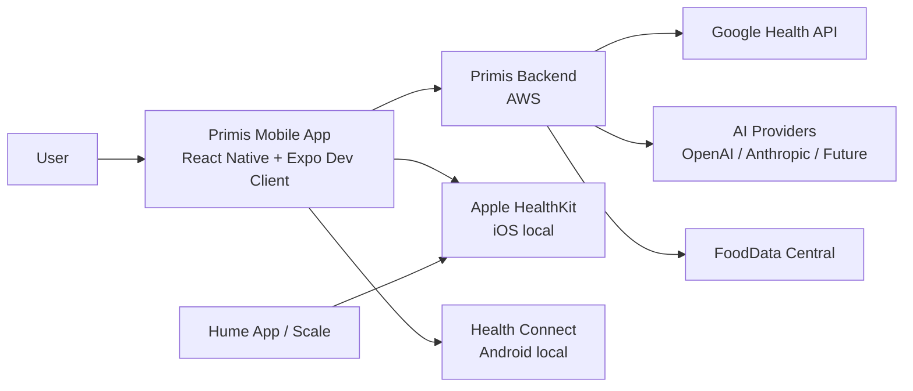
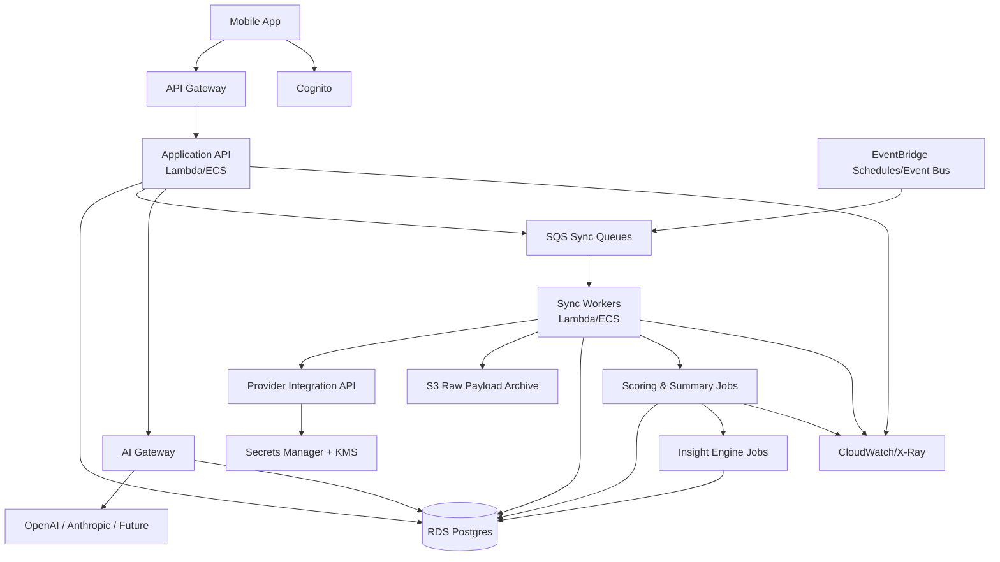
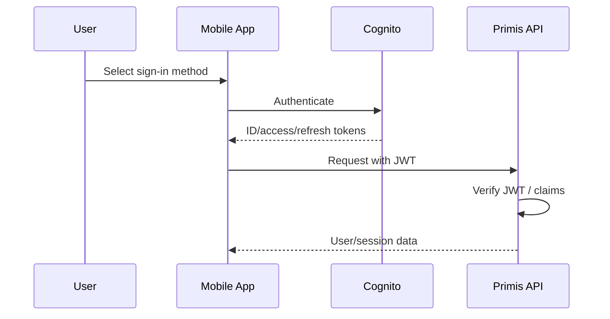
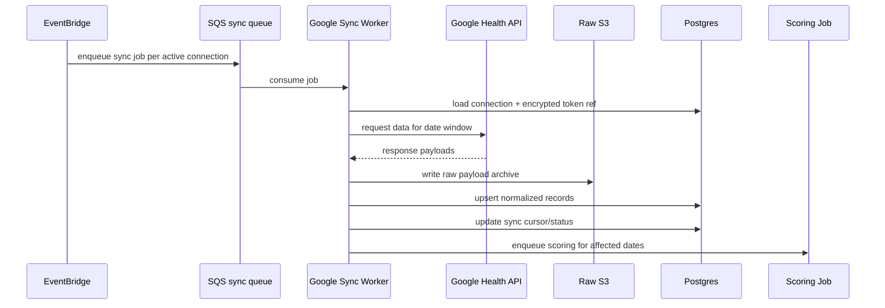
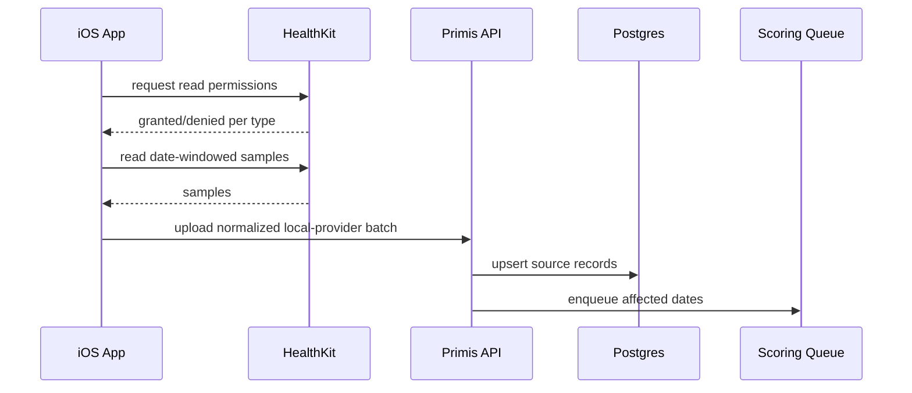
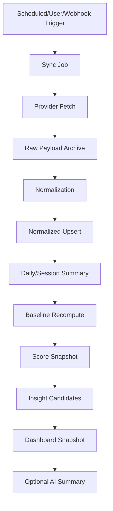
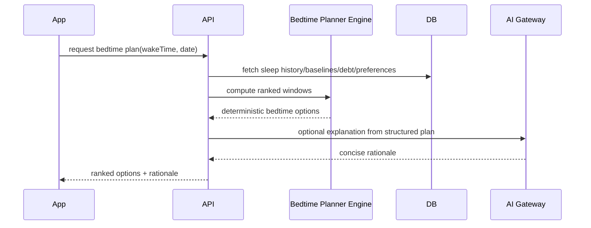
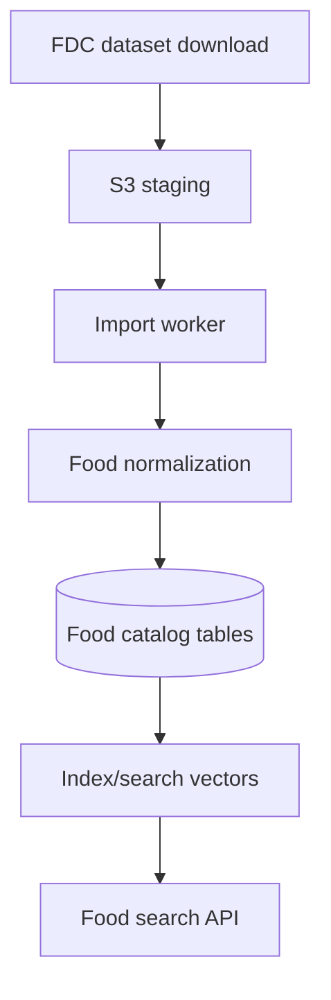

# Primis Technical Architecture Document

**Document type:** Technical Architecture Document (TAD)  
**Product:** Primis  
**Version:** 1.1  
**Status:** Draft for implementation planning  
**Prepared for:** Evan / Primis private beta  
**Last updated:** 2026-06-07  
**Primary audience:** AI coding agents, software engineers, mobile engineers, backend engineers, data engineers, infrastructure engineers, security reviewers

---

## 0. AI Coding Agent Instructions

This document is intended to be consumed by AI coding agents and human engineers. Treat it as the technical source of truth for architecture decisions unless superseded by a later architecture decision record.

### 0.1 How to use this document

1. **Do not improvise architecture.** Follow the component boundaries, data-flow rules, and phase definitions in this document.
2. **Use IDs in implementation plans.** Reference architecture IDs like `ARCH-AUTH-001`, `ARCH-SYNC-003`, and `ARCH-AI-006` in tickets, commits, and code comments where useful.
3. **Implement in phases.** Do not build Phase 3/4/5 systems before Phase 0/1 validation unless explicitly instructed.
4. **Separate deterministic logic from AI generation.** AI may explain, summarize, rank, and coach from structured context. AI must not be the only mechanism computing health scores.
5. **Optimize for fast perceived performance.** Critical screens must load from local cache or precomputed backend summaries. Do not block home/sleep/recovery views on fresh sync, heavy analytics, or AI generation.
6. **Treat health data as sensitive.** Encrypt data, minimize scopes, honor deletion, log access carefully, and avoid leaking raw health data into logs, analytics, or AI prompts.
7. **Do not assume a provider exposes a metric.** If Google/Apple/Health Connect/Hume availability is not verified, create a technical spike and mark the metric as `provider_unverified`.
8. **Prefer append-only raw ingestion + normalized processing.** Preserve provider payloads where practical so algorithms can be re-run later.
9. **Fail gracefully.** Every provider sync, AI generation, chart, and score must handle missing data.
10. **Keep product polish in the architecture.** UI/UX quality, animation performance, caching, and data-loading strategy are part of architecture, not later cleanup.

### 0.2 Requirement language

- **MUST:** Required.
- **SHOULD:** Strongly recommended unless blocked by platform limits or cost.
- **MAY:** Optional or later-phase enhancement.
- **MUST NOT:** Explicitly forbidden unless a later decision overrides it.

### 0.3 Relationship to other Primis documents

This document is one of seven intended source-of-truth documents:

1. Product Requirements Document
2. Technical Architecture Document
3. Health Data Model / Metric Schema
4. Scoring & Algorithms Spec
5. AI Context Engine Spec
6. UI/UX Design System Spec
7. MVP Build Plan / Milestones

This TAD focuses on system architecture, component boundaries, data flows, infrastructure, security, performance, AI integration architecture, and build sequencing.

Detailed score formulas belong primarily in the Scoring & Algorithms Spec. Detailed visual tokens, motion specs, and design components belong primarily in the UI/UX Design System Spec. Detailed metric table definitions belong primarily in the Health Data Model / Metric Schema.

---

## 1. Executive Technical Summary

Primis is an AI-native performance health OS. The technical system must ingest user-authorized health data, normalize it into a mature internal health model, compute derived metrics and score snapshots, generate deterministic insight candidates, and expose those results through a fast, premium mobile app. AI is a first-class product layer, but it sits on top of structured data, score snapshots, and retrieval context.

The initial product uses:

- **Mobile:** React Native + Expo Dev Client, iOS-first, Android-ready.
- **Backend:** AWS-native mature stack.
- **Primary provider:** Google Health API for Google/Fitbit data.
- **Secondary iOS provider:** Apple HealthKit for iPhone-local health aggregation and Hume-via-Apple-Health enrichment.
- **Future Android provider:** Health Connect.
- **AI:** Model-abstracted backend gateway, GPT as first provider, Anthropic/future providers supported by interface.
- **Nutrition:** Manual logging first, FoodData Central local catalog later, MyFitnessPal only with official access.
- **Storage:** RDS Postgres for normalized structured data, S3 for raw payload archive, KMS encryption, lifecycle policies where cost requires.
- **Async processing:** EventBridge schedules/events, SQS queues, Lambda/ECS workers, idempotent sync jobs.
- **Performance model:** Local-first mobile cache + precomputed backend summaries + background sync + AI context packets.

The architecture must support a private beta with only the founder and one friend while avoiding shortcuts that would prevent a future public B2C launch.

---

## 2. Architecture Goals and Non-Goals

### 2.1 Goals

| ID | Goal | Description |
|---|---|---|
| ARCH-GOAL-001 | Mature health-data foundation | Build normalized, extensible health data stores that can support Google/Fitbit, HealthKit, Health Connect, body composition, nutrition, manual inputs, scoring, AI, and future integrations. |
| ARCH-GOAL-002 | Fast premium mobile UX | Home, Sleep, Recovery, and Activity screens must feel instant using local cache, precomputed summaries, and optimistic rendering. |
| ARCH-GOAL-003 | Secure sensitive data handling | Encrypt health data, provider tokens, raw payloads, AI context logs, and user identity data appropriately. |
| ARCH-GOAL-004 | AI-native but deterministic-core | Support chat, summaries, coaching, and recommendations using AI while keeping scoring, normalization, and trend detection deterministic and testable. |
| ARCH-GOAL-005 | Provider abstraction | Add providers through connector modules without rewriting scoring, AI, or UI layers. |
| ARCH-GOAL-006 | Low-cost private beta with public-launch path | Use AWS-native services with cost controls, but avoid fragile indie shortcuts that would block security review, app review, or OAuth verification. |
| ARCH-GOAL-007 | Reprocessable historical data | Preserve enough raw/provider-level data to reprocess when schemas, algorithms, or scoring weights improve. |
| ARCH-GOAL-008 | AI-agent implementation clarity | Provide explicit boundaries, schemas, APIs, jobs, and implementation sequencing to reduce AI coding-agent drift. |

### 2.2 Non-goals

| ID | Non-goal | Rationale |
|---|---|---|
| ARCH-NONGOAL-001 | Medical diagnosis platform | Primis is performance/wellness software, not diagnostic or disease-treatment software. |
| ARCH-NONGOAL-002 | Real-time wearable telemetry | Fitbit/Google provider sync is not truly real-time. Primis should show recent data after provider sync, not promise live telemetry. |
| ARCH-NONGOAL-003 | Full MyFitnessPal clone in v1 | Food catalog, barcode scanning, serving-size normalization, and meal UX are significant scope. Basic nutrition comes first. |
| ARCH-NONGOAL-004 | Raw-data-to-LLM scoring | LLMs must not compute core scores directly from raw data. |
| ARCH-NONGOAL-005 | Every provider in v1 | Google Health API first; HealthKit second; Health Connect later. |
| ARCH-NONGOAL-006 | Full custom dashboard engine across every screen in v1 | Home widgets are customizable first. Deeper page customization can come later. |
| ARCH-NONGOAL-007 | Public launch before OAuth/security readiness | Public launch requires Google verification/security readiness and user trust controls. |

---

## 3. External Platform Constraints and Research-Backed Assumptions

This section captures current integration constraints that affect architecture. AI coding agents must not contradict this section without updated evidence.

### 3.1 Google Health API

| ID | Constraint | Architecture implication |
|---|---|---|
| EXT-GOOGLE-001 | Most Google Health API scopes are restricted and public apps must complete verification before public availability. Unverified apps are limited to 100 users. | Private beta can proceed with controlled users. Public launch requires OAuth verification/security assessment readiness. |
| EXT-GOOGLE-002 | Google Health API rate limits include project daily/minute limits and per-user minutely limits. Default documented values include 86.4M requests/day/project, 120,000 requests/min/project, and 300 requests/min/user. | Sync jobs must batch, backoff on 429, and avoid request explosions. Use incremental sync and daily summaries. |
| EXT-GOOGLE-003 | Google Health API exposes many data types relevant to Primis, including activity, calories, steps, floors, heart rate, HRV, resting HR, oxygen saturation, respiratory rate, sleep sessions, VO2 max, hydration, nutrition, weight, body fat, ECG/irregular rhythm where available. | The health model should support these categories. Phase 0 must verify which data actually arrives from Fitbit Air / Google Health account. |
| EXT-GOOGLE-004 | Google/Fitbit proprietary app scores such as Sleep Score, Readiness, or Cardio Load may not be exposed as first-class API objects even if visible in Google/Fitbit app. | Primis must compute its own scores from exposed raw/summary data. Provider scores may be stored if exposed later. |
| EXT-GOOGLE-005 | Fitbit devices sync through Google/Fitbit app/cloud before third-party API access. | Primis should display provider-data freshness and not promise live second-by-second telemetry. |
| EXT-GOOGLE-006 | Google requires prominent in-app disclosure for health/fitness data access and usage. | Onboarding/auth flows must include clear in-app disclosure before health scopes. |

Primary source references:

- Google Health API app verification: https://developers.google.com/health/app-verification
- Google Health API rate limits: https://developers.google.com/health/rate-limits
- Google Health API data types: https://developers.google.com/health/data-types

### 3.2 Apple HealthKit

| ID | Constraint | Architecture implication |
|---|---|---|
| EXT-APPLE-001 | HealthKit requires explicit user authorization for each read/write data type. | iOS provider connector must request minimal scopes and handle partial permissions. |
| EXT-APPLE-002 | HealthKit data is device-local and accessed through iOS APIs, not directly by the backend. | Mobile app must read HealthKit locally, then optionally sync normalized records to backend. |
| EXT-APPLE-003 | Hume Health likely syncs body composition into Apple Health, but direct Hume API access is not currently assumed. | Hume integration should be via HealthKit body-composition data initially. |

Primary source references:

- Apple HealthKit authorization: https://developer.apple.com/documentation/healthkit/authorizing-access-to-health-data
- Apple HealthKit overview: https://developer.apple.com/documentation/healthkit

### 3.3 Android Health Connect

| ID | Constraint | Architecture implication |
|---|---|---|
| EXT-HC-001 | Health Connect requires declared permissions and user-granted permission per record/data type. | Android connector must be permission-aware and handle partial availability. |
| EXT-HC-002 | By default, apps can read Health Connect data only up to 30 days before permission grant unless requesting historical read permission. | Android phase must include permission planning for historical data. |
| EXT-HC-003 | Health Connect imposes rate limits and encourages efficient reads. | Use date-windowed incremental reads and local caching. |

Primary source references:

- Health Connect read data: https://developer.android.com/health-and-fitness/health-connect/read-data
- Health Connect data types: https://developer.android.com/health-and-fitness/health-connect/data-types
- Health Connect rate limiting: https://developer.android.com/health-and-fitness/health-connect/rate-limiting

### 3.4 Expo / React Native

| ID | Constraint | Architecture implication |
|---|---|---|
| EXT-RN-001 | Expo Go cannot access arbitrary custom native code; development builds can include custom native libraries. | Primis MUST use Expo Dev Client / EAS development builds, not Expo Go, once HealthKit/Health Connect/native modules are used. |
| EXT-RN-002 | Expo supports custom native code through libraries with native code or Expo Modules API. | HealthKit/Health Connect connectors can be implemented via maintained libraries or local native modules. |

Primary source references:

- Expo custom native code: https://docs.expo.dev/workflow/customizing/
- React Native environment setup / Expo production-grade RN framework: https://reactnative.dev/docs/environment-setup

### 3.5 AWS Cognito

| ID | Constraint | Architecture implication |
|---|---|---|
| EXT-AWS-AUTH-001 | Cognito user pools can integrate with social identity providers including Google, Facebook, Amazon, and Apple. | Primis can support email/password plus Google, Apple, Facebook sign-in through Cognito. |
| EXT-AWS-AUTH-002 | App authentication is separate from Google Health authorization. | A user signing in with Google does not automatically grant Google Health data scopes. Separate provider-connection flows are required. |

Primary source reference:

- Cognito social identity providers: https://docs.aws.amazon.com/cognito/latest/developerguide/cognito-user-pools-social-idp.html

### 3.6 FoodData Central / MyFitnessPal

| ID | Constraint | Architecture implication |
|---|---|---|
| EXT-NUTRITION-001 | USDA FoodData Central provides downloadable datasets and public-domain/CC0 data. | Primis can bulk-import FoodData Central into its own food catalog rather than making live API calls for every query. |
| EXT-NUTRITION-002 | MyFitnessPal API is private and available only to approved developers. | MyFitnessPal must not be treated as a v1 dependency. Do not scrape or use unofficial integrations. |

Primary source references:

- FoodData Central downloads: https://fdc.nal.usda.gov/download-datasets
- FoodData Central API guide: https://fdc.nal.usda.gov/api-guide
- MyFitnessPal API page: https://www.myfitnesspal.com/apps/api/version

---

## 4. Architectural Principles

### ARCH-PRINCIPLE-001: Layered intelligence

Primis intelligence must be layered:

```text
Provider data
→ raw storage
→ normalization
→ summaries
→ baselines
→ scores
→ insight candidates
→ AI context packet
→ AI explanation/coaching
→ mobile UI
```

Do not bypass normalization and scoring by sending raw provider data directly to an LLM.

### ARCH-PRINCIPLE-002: Local-first perceived performance

The mobile app must render core screens from local cache first, then reconcile with fresh backend data.

Critical screens:

- Home
- Sleep
- Recovery
- Activity
- Vitals summary

These screens must never wait for AI generation to display objective data.

### ARCH-PRINCIPLE-003: Provider independence

Google, HealthKit, Health Connect, FoodData Central, manual input, and future integrations must be implemented as provider connectors that emit normalized events/records into shared pipelines.

Provider-specific logic must not leak into score formulas or UI components except where explicitly rendering source attribution/debug information.

### ARCH-PRINCIPLE-004: Idempotent processing

Every sync/import/scoring job must be safe to retry.

Implementation requirements:

- Use idempotency keys.
- Track provider cursors/windows.
- Use upsert semantics for normalized records.
- Avoid duplicate metric points.
- Preserve job status and error reasons.

### ARCH-PRINCIPLE-005: Precompute expensive work

Precompute:

- daily summaries
- rolling baselines
- score snapshots
- chart-ready series
- insight candidates
- AI context summaries

Do not calculate these repeatedly on screen render.

### ARCH-PRINCIPLE-006: Privacy by architecture

Health data must be protected through technical design, not only policy text.

Required mechanisms:

- Least privilege OAuth scopes.
- Provider token encryption.
- KMS-backed encryption for sensitive storage.
- No raw health payloads in logs.
- Structured deletion workflows.
- Clear data-access boundaries.
- AI prompt/context minimization.

### ARCH-PRINCIPLE-007: Cost-aware maturity

The stack should be mature but not wasteful.

Use serverless/on-demand where possible for private beta, but choose components that can scale into public launch:

- Lambda first for lightweight APIs/jobs.
- ECS/Fargate only where jobs exceed Lambda limits or need longer-running workloads.
- RDS Postgres for relational correctness and query power.
- S3 lifecycle policies for raw data cost control.

---

## 5. System Context

### 5.1 Actors

| Actor | Description |
|---|---|
| User | Primis mobile user who connects accounts, views insights, logs manual inputs, chats with AI. |
| Mobile App | React Native app running on iOS initially, Android later. |
| Primis Backend | AWS-hosted APIs, jobs, processing pipelines, AI gateway, storage. |
| Google Health API | Primary health-data provider for Google/Fitbit data. |
| Apple HealthKit | iOS-local health data repository used for Apple Health/Hume enrichment. |
| Health Connect | Android health aggregation layer for future Android support. |
| AI Providers | OpenAI first; Anthropic and future models via abstraction. |
| FoodData Central | Nutrition catalog source for v1.5 food database import. |
| App Store / Play Store | Distribution and review platforms. |

### 5.2 C4-style system context diagram



### 5.3 Core architecture diagram



---

## 6. Technology Stack

### 6.1 Mobile stack

| Layer | Decision | Notes |
|---|---|---|
| Framework | React Native | Chosen for iOS-first with Android future and user’s React background. |
| Expo mode | Expo Dev Client / EAS builds | Required for native modules; Expo Go is insufficient. |
| Navigation | Expo Router or React Navigation | Use one; avoid mixing. Expo Router preferred if using file-based app structure. |
| Animation | React Native Reanimated | Required for premium transitions/microinteractions. |
| Charts/advanced rendering | React Native Skia | Use for high-performance custom charts and visualizations. |
| Gestures | React Native Gesture Handler | Use for interactive cards/widgets/charts. |
| Server state | TanStack Query | Caching, stale-while-revalidate, retries, optimistic updates. |
| Local DB | SQLite / Expo SQLite or WatermelonDB | Store dashboard snapshots, chart series, manual drafts, recent AI summaries. |
| Fast key-value | MMKV or SecureStore/MMKV split | MMKV for UI settings/cache flags; SecureStore/Keychain for device-local sensitive tokens if needed. |
| Forms | React Hook Form + Zod | Manual inputs, onboarding, settings. |
| Validation | Zod shared schemas | Align mobile/backend DTOs. |
| Error tracking | Sentry | Add in Phase 1/2. |
| Analytics | Minimal privacy-safe product analytics | Do not log health values. Track feature usage only. |

### 6.2 Backend stack

| Layer | Decision | Notes |
|---|---|---|
| Cloud | AWS | Mature stack as requested. |
| Auth | Cognito User Pools | Email/password + Google + Apple + Facebook login. |
| API edge | API Gateway HTTP API | Front door for mobile app. |
| Compute | Lambda first; ECS/Fargate for heavier jobs | Keep costs low while preserving maturity. |
| Primary DB | RDS Postgres | Relational model, JSONB flexibility, analytics queries, strong correctness. |
| Raw data | S3 | Raw provider payload archive, encrypted with KMS, lifecycle policies. |
| Queues | SQS + DLQs | Provider sync, normalization, scoring, AI summary jobs. |
| Scheduling/events | EventBridge | Scheduled syncs and event bus patterns. |
| Secrets | Secrets Manager | Provider client secrets, OAuth tokens where appropriate, model API keys. |
| Encryption | KMS | CMKs for S3/RDS/Secrets where appropriate. |
| Observability | CloudWatch, X-Ray, structured logs | Add dashboards/alarms. |
| IaC | AWS CDK or Terraform | CDK recommended if using TypeScript monorepo. |
| CI/CD | GitHub Actions + AWS deploy roles | OIDC to AWS, no long-lived AWS keys in GitHub. |

### 6.3 Backend language decision

Recommended backend language:

```text
TypeScript for API/services + Python for data/scoring experiments only if needed.
```

Default choice for implementation:

- **TypeScript** for application API, provider connectors, DTOs, schema validation, event types, AI gateway, and CDK.
- **Python** may be used later for analytics/scoring notebooks, ML experiments, or batch model training.

Reasoning:

- Shared type thinking between React Native and backend.
- AI coding agents are generally strong with TypeScript service boundaries.
- CDK TypeScript is clean for AWS-native IaC.
- Python can be introduced only where it clearly improves data science/ML work.

---

## 7. Repository and Code Organization

### 7.1 Recommended monorepo

Use a monorepo to keep shared schemas, types, and docs synchronized.

```text
primis/
  apps/
    mobile/                     # React Native / Expo app
    admin/                      # Optional future internal admin app
  services/
    api/                        # Main backend API service
    workers/                    # Async worker handlers
    sync/                       # Provider sync modules
    ai-gateway/                 # Model abstraction + context orchestration
    scoring/                    # Deterministic scoring/insight engine
  packages/
    shared-types/               # Shared TypeScript types/interfaces
    schemas/                    # Zod/OpenAPI schemas
    health-model/               # Metric definitions/constants
    ui/                         # Shared RN design primitives if useful
    config/                     # Environment/config utilities
  infra/
    cdk/                        # AWS CDK app/stacks
  docs/
    prd.md
    technical-architecture.md
    health-data-model.md
    scoring-algorithms.md
    ai-context-engine.md
    ui-ux-design-system.md
    mvp-build-plan.md
  scripts/
    import-fooddata-central/
    data-validation/
  tests/
    fixtures/
    contract/
```

### 7.2 Package manager

Use `pnpm` workspaces unless a later tool choice requires otherwise.

```text
pnpm-workspace.yaml
package.json
apps/mobile/package.json
services/api/package.json
packages/shared-types/package.json
```

### 7.3 Code boundary rules

| ID | Rule |
|---|---|
| ARCH-CODE-001 | Mobile app MUST NOT contain provider API client secrets. |
| ARCH-CODE-002 | Mobile app MAY call HealthKit/Health Connect locally because those are device permission APIs. |
| ARCH-CODE-003 | Google Health API access MUST run through backend provider connector, not direct mobile calls for protected sync. |
| ARCH-CODE-004 | Scoring functions MUST be deterministic and unit tested. |
| ARCH-CODE-005 | AI prompts MUST be generated by backend AI context engine, not scattered in mobile components. |
| ARCH-CODE-006 | Shared DTO schemas MUST live in shared packages and be imported by both mobile/backend where practical. |
| ARCH-CODE-007 | Database writes MUST pass through repository/service layers; avoid raw SQL scattered through handlers. |
| ARCH-CODE-008 | Health metric definitions MUST be centralized, not hardcoded in UI screens. |

---

## 8. Environment Strategy

### 8.1 Environments

| Environment | Purpose | Notes |
|---|---|---|
| local | Local mobile/backend development | Docker Postgres, local env vars, mocked providers where needed. |
| dev | Cloud development sandbox | Real AWS resources with low-cost settings; test users only. |
| staging | Pre-release validation | Mirrors prod security patterns; used for app review/testing. |
| prod | Public/private production | Real user data, strict IAM, alarms, backups. |

### 8.2 Environment isolation

Each environment MUST have separate:

- Cognito user pool
- RDS database
- S3 buckets
- KMS keys or aliases
- Secrets Manager secrets
- Google OAuth client/project where needed
- AI provider keys
- EventBridge schedules
- SQS queues/DLQs

### 8.3 Configuration loading

Backend services MUST load config from:

- environment variables for non-secret config
- Secrets Manager for secrets
- SSM Parameter Store for environment-level config if needed

Mobile app MUST use build-time public config only for non-sensitive values.

Forbidden:

- provider client secrets in mobile bundle
- AI provider keys in mobile bundle
- raw AWS credentials in app or GitHub

---

## 9. Authentication and Identity Architecture

### 9.1 Auth model

Primis requires accounts from v1.

Supported sign-in methods:

- Email/password
- Google
- Apple
- Facebook

Architecture:



### 9.2 Important separation: app auth vs health provider authorization

A user signing in with Google is not the same as connecting Google Health data.

```text
App authentication:
User proves identity to Primis.

Provider authorization:
User grants Primis permission to access health data from Google Health API.
```

These must be modeled separately.

Tables:

```text
users
user_auth_identities
provider_connections
provider_oauth_tokens
```

### 9.3 User identity requirements

| ID | Requirement |
|---|---|
| ARCH-AUTH-001 | `users.id` MUST be an internal UUID/ULID independent of Cognito subject. |
| ARCH-AUTH-002 | Store Cognito `sub` as an auth identity mapping, not as the primary internal health-data key. |
| ARCH-AUTH-003 | Provider connections MUST be linked to internal `user_id`. |
| ARCH-AUTH-004 | A user MAY have multiple auth identities later. |
| ARCH-AUTH-005 | Account deletion MUST delete or schedule deletion of provider tokens, raw payloads, normalized health data, AI summaries, and manual entries. |

### 9.4 Session/security expectations

- Mobile app stores auth tokens in platform-secure storage where applicable.
- Backend validates Cognito JWTs on every request.
- Privileged admin operations require separate admin role/claims.
- No health endpoint accepts a user ID from the client as authority; user identity comes from validated token claims.

---

## 10. Provider Integration Architecture

### 10.1 Provider connector pattern

Every provider connector should implement a common interface.

```ts
interface HealthProviderConnector {
  providerKey: ProviderKey;
  startAuthorization(userId: string, requestedScopes: string[]): Promise<AuthStartResult>;
  completeAuthorization(userId: string, callbackParams: AuthCallbackParams): Promise<ProviderConnection>;
  refreshConnection(connectionId: string): Promise<void>;
  syncWindow(connectionId: string, window: SyncWindow): Promise<ProviderSyncResult>;
  revokeConnection(connectionId: string): Promise<void>;
  getCapabilities(connectionId: string): Promise<ProviderCapabilities>;
}
```

Provider keys:

```text
google_health
apple_healthkit
android_health_connect
manual_input
fooddata_central
hume_via_healthkit
future_oura
future_whoop
future_garmin
```

### 10.2 Provider capability model

Provider availability must be explicit.

```ts
interface ProviderCapabilities {
  providerKey: ProviderKey;
  metrics: Array<{
    metricType: string;
    access: 'read' | 'write' | 'read_write';
    granularity: 'raw' | 'session' | 'daily' | 'summary';
    historicalDepth?: string;
    verified: boolean;
    notes?: string;
  }>;
  supportsWebhooks: boolean;
  supportsIncrementalSync: boolean;
  requiresMobileLocalAccess: boolean;
}
```

### 10.3 Google Health API connector

#### 10.3.1 Responsibilities

The Google Health connector MUST:

- initiate OAuth authorization for Google Health scopes
- store/refresh OAuth tokens securely
- discover/track granted scopes
- pull available health data by metric type/date window
- backoff/retry on rate limits
- persist raw responses to S3 when configured
- normalize responses into internal metric/session records
- emit sync-completed events

#### 10.3.2 Phase 0 data-availability spike

Before building production score dependencies, implement a spike that verifies:

| Metric family | Required validation |
|---|---|
| sleep | sessions, stages, start/end, wake periods, availability latency |
| HRV | daily HRV and/or time-series availability |
| resting HR | daily resting HR availability |
| heart rate | time-series granularity availability |
| respiratory rate | daily/sleep summary availability |
| SpO2 | daily/sleep availability |
| steps | daily and interval availability |
| calories | active, resting/total availability |
| workouts | exercise sessions and details |
| floors | availability from Fitbit Air |
| VO2 max | availability |
| weight/body fat | availability if user has scale/provider data |
| provider scores | validate whether Google exposes Sleep Score, Readiness, Cardio Load as API fields |

The spike output MUST be a data availability report saved under `docs/research/google-health-data-availability.md`.

#### 10.3.3 Sync flow



#### 10.3.4 Sync window strategy

| Sync type | Window | Purpose |
|---|---|---|
| initial backfill | as much as provider allows/practical | Build history for baselines. |
| daily incremental | last 3 days | Catch late-arriving/updated sleep and vitals data. |
| recent refresh | last 24 hours | Fast dashboard freshness. |
| weekly reconciliation | last 14-30 days | Fix provider corrections and delayed data. |
| manual refresh | user-triggered recent window | Let user refresh visible dashboard. |

Implementation note: provider APIs may have specific pagination/date limits. Connector must adapt by splitting windows into safe chunks.

### 10.4 Apple HealthKit connector

HealthKit is mobile-local. Backend cannot directly query Apple Health.

Architecture:



Requirements:

| ID | Requirement |
|---|---|
| ARCH-HK-001 | HealthKit integration MUST request permissions per data type and handle partial permissions. |
| ARCH-HK-002 | HealthKit data MUST be tagged with `provider_key=apple_healthkit` and source metadata. |
| ARCH-HK-003 | Hume-via-Apple-Health body composition data MUST be represented as HealthKit-sourced body metric records unless direct Hume API exists later. |
| ARCH-HK-004 | HealthKit upload batches MUST be idempotent. |
| ARCH-HK-005 | HealthKit read jobs MUST not freeze UI; they run in background or user-triggered flows. |
| ARCH-HK-006 | If identical metrics exist from Google and HealthKit, source priority/conflict rules must apply. |

### 10.5 Android Health Connect connector

Phase 5 or later unless accelerated.

Requirements:

| ID | Requirement |
|---|---|
| ARCH-HC-001 | Use Health Connect permissions per data type. |
| ARCH-HC-002 | Plan for historical permission if reading beyond default history window. |
| ARCH-HC-003 | Use local incremental reads and upload normalized batches to backend. |
| ARCH-HC-004 | Handle devices without Health Connect availability gracefully. |

### 10.6 Hume Health path

Current assumed path:

```text
Hume scale → Hume app → Apple Health → HealthKit → Primis
```

Direct Hume API must not be assumed. If direct access becomes available, implement a separate `hume_direct` provider connector.

---

## 11. Data Architecture Overview

Detailed schema belongs in the Health Data Model document. This section defines architectural boundaries.

### 11.1 Data layers

| Layer | Storage | Purpose |
|---|---|---|
| Provider raw data | S3 | Preserve provider payloads for replay/reprocessing/audit. |
| Provider source records | Postgres | Provider-specific metadata, cursors, source IDs, raw references. |
| Normalized metric points | Postgres | Unified time-series metric records. |
| Sessions | Postgres | Sleep sessions, workouts, future meditation/sauna/etc. |
| Daily summaries | Postgres | Precomputed day-level aggregates. |
| Baselines | Postgres | Rolling personal baseline values. |
| Score snapshots | Postgres | Deterministic score outputs by day/session. |
| Insight candidates | Postgres | Deterministically generated observations. |
| AI summaries/conversations | Postgres + optional S3 for larger logs | AI outputs and conversation state. |
| Mobile cache | SQLite/MMKV | Fast local rendering and offline-friendly recent state. |

### 11.2 Core data entities

Minimum core tables:

```text
users
user_profiles
user_goals
user_preferences
provider_connections
provider_sync_jobs
provider_sync_cursors
raw_payload_refs
metric_points
metric_daily_summaries
sleep_sessions
sleep_stage_segments
workout_sessions
workout_hr_zone_segments
body_composition_measurements
nutrition_entries
hydration_entries
caffeine_entries
alcohol_entries
bowel_entries
manual_checkins
custom_tags
day_tags
score_snapshots
baseline_snapshots
insight_candidates
ai_context_snapshots
ai_conversations
ai_messages
dashboard_widgets
theme_settings
data_retention_preferences
```

### 11.3 Raw payload storage

Raw payload path pattern:

```text
s3://primis-{env}-raw-health-data/
  provider={provider_key}/
  user_id_hash={hash_prefix}/
  user_id={internal_user_id}/
  connection_id={connection_id}/
  metric_family={metric_family}/
  sync_job_id={sync_job_id}/
  window_start={yyyy-mm-dd}/
  window_end={yyyy-mm-dd}/
  payload_{sequence}.json.gz
```

Security:

- Bucket private.
- SSE-KMS encryption.
- No public access.
- Access only by worker roles and limited admin break-glass roles.
- Lifecycle policies configurable by environment/user retention preference.

### 11.4 Data retention defaults

| User segment | Raw payload retention | Normalized data retention | Notes |
|---|---|---|---|
| founder/dev | indefinite unless deleted | indefinite unless deleted | Best for experimentation/reprocessing. |
| private beta | indefinite initially if cost acceptable | indefinite unless deleted | Add retention controls before broader launch. |
| future public default | 30-180 days raw, longer normalized summaries | indefinite or user-configurable | Final default TBD. |
| user deletes account | delete/schedule deletion | delete/schedule deletion | Must include provider tokens and AI records. |

### 11.5 Source conflict resolution

Some metrics may arrive from multiple sources.

Example: weight from Google, Apple Health, and Hume-via-Apple-Health.

Rules:

1. Never silently merge different source records into one without source metadata.
2. Store all source records when useful.
3. Select a canonical value for scores/summaries through source-priority rules.
4. Allow future user preference for source priority.
5. Keep a data-quality flag for derived calculations.

Example priority for body composition:

```text
hume_via_healthkit > apple_healthkit_generic > google_health > manual_entry
```

Example priority for Fitbit sleep when Google Health is primary:

```text
google_health_sleep > apple_healthkit_sleep unless user overrides
```

---

## 12. API Architecture

### 12.1 API style

Use REST/JSON initially.

Reasons:

- Simpler for mobile and AI agents.
- Easy to secure through API Gateway/Cognito authorizers.
- Clear endpoint boundaries.
- GraphQL is not necessary in v1.

OpenAPI specs SHOULD be generated/maintained from schemas.

### 12.2 API versioning

All external mobile APIs should be versioned:

```text
/api/v1/...
```

Breaking changes require a new version or backward-compatible field addition.

### 12.3 Endpoint groups

#### Auth/session

```http
GET    /api/v1/me
PATCH  /api/v1/me/profile
GET    /api/v1/me/preferences
PATCH  /api/v1/me/preferences
DELETE /api/v1/me
```

#### Provider connections

```http
GET    /api/v1/providers
GET    /api/v1/provider-connections
POST   /api/v1/provider-connections/google-health/start
POST   /api/v1/provider-connections/google-health/callback
POST   /api/v1/provider-connections/{connectionId}/sync
DELETE /api/v1/provider-connections/{connectionId}
GET    /api/v1/provider-connections/{connectionId}/status
```

#### Dashboard

```http
GET    /api/v1/dashboard/home?date=YYYY-MM-DD
GET    /api/v1/dashboard/widgets
PUT    /api/v1/dashboard/widgets
GET    /api/v1/dashboard/snapshot?date=YYYY-MM-DD
```

#### Sleep

```http
GET    /api/v1/sleep/summary?start=YYYY-MM-DD&end=YYYY-MM-DD
GET    /api/v1/sleep/sessions/{sessionId}
GET    /api/v1/sleep/bedtime-planner?wakeTime=ISO&date=YYYY-MM-DD
POST   /api/v1/sleep/bedtime-planner/plans
```

#### Recovery/readiness

```http
GET    /api/v1/recovery/summary?date=YYYY-MM-DD
GET    /api/v1/recovery/trends?start=YYYY-MM-DD&end=YYYY-MM-DD
GET    /api/v1/readiness/summary?date=YYYY-MM-DD
```

#### Activity/training

```http
GET    /api/v1/activity/summary?start=YYYY-MM-DD&end=YYYY-MM-DD
GET    /api/v1/workouts?start=YYYY-MM-DD&end=YYYY-MM-DD
GET    /api/v1/workouts/{workoutId}
GET    /api/v1/training-load/summary?date=YYYY-MM-DD
```

#### Vitals/body composition

```http
GET    /api/v1/vitals/summary?start=YYYY-MM-DD&end=YYYY-MM-DD
GET    /api/v1/body/summary?start=YYYY-MM-DD&end=YYYY-MM-DD
```

#### Manual inputs

```http
POST   /api/v1/checkins
GET    /api/v1/checkins?start=YYYY-MM-DD&end=YYYY-MM-DD
PATCH  /api/v1/checkins/{checkinId}
DELETE /api/v1/checkins/{checkinId}
POST   /api/v1/tags
GET    /api/v1/tags
POST   /api/v1/day-tags
```

#### Nutrition

```http
POST   /api/v1/nutrition/entries
GET    /api/v1/nutrition/entries?date=YYYY-MM-DD
GET    /api/v1/nutrition/summary?start=YYYY-MM-DD&end=YYYY-MM-DD
GET    /api/v1/foods/search?q=QUERY
POST   /api/v1/foods/user-foods
```

#### AI

```http
POST   /api/v1/ai/chat
GET    /api/v1/ai/conversations
GET    /api/v1/ai/conversations/{conversationId}
POST   /api/v1/ai/summaries/sleep/{sessionId}
POST   /api/v1/ai/summaries/workout/{workoutId}
POST   /api/v1/ai/recommendations/today
```

#### Data controls

```http
GET    /api/v1/data/export/status
POST   /api/v1/data/export
POST   /api/v1/data/delete-provider-data
POST   /api/v1/data/delete-all
GET    /api/v1/data/retention-preferences
PUT    /api/v1/data/retention-preferences
```

### 12.4 API response design

API responses for dashboard views should be already shaped for the app.

Example home response:

```json
{
  "date": "2026-06-02",
  "generatedAt": "2026-06-02T13:00:00Z",
  "dataFreshness": {
    "googleHealthLastSyncAt": "2026-06-02T12:50:00Z",
    "latestProviderDataAt": "2026-06-02T12:35:00Z"
  },
  "scores": {
    "recovery": { "value": 72, "status": "moderate", "trend": "down" },
    "sleep": { "value": 81, "status": "good", "trend": "up" },
    "readiness": { "value": 68, "status": "moderate", "trend": "down" }
  },
  "widgets": [
    {
      "widgetId": "recovery-card",
      "type": "score_card",
      "title": "Recovery",
      "payload": { "score": 72, "primaryReason": "HRV below baseline" }
    }
  ]
}
```

### 12.5 API performance requirements

| Endpoint category | Target |
|---|---|
| home dashboard cached response | p95 < 300 ms backend time |
| score summary response | p95 < 400 ms backend time |
| chart-ready trend response | p95 < 600 ms backend time |
| AI chat first token | best effort; should not block objective UI |
| manual input create | p95 < 300 ms backend time |
| provider sync trigger | returns job accepted quickly; does not run full sync inline |

---

## 13. Event and Async Processing Architecture

### 13.1 Event taxonomy

Use explicit event names.

```text
provider.connection.created
provider.connection.revoked
provider.sync.requested
provider.sync.started
provider.sync.completed
provider.sync.failed
health.records.normalized
summary.recompute.requested
summary.recompute.completed
scores.recompute.requested
scores.recompute.completed
insights.recompute.requested
insights.recompute.completed
ai.summary.requested
ai.summary.completed
user.checkin.created
user.preferences.updated
```

### 13.2 Queue strategy

| Queue | Purpose | DLQ required |
|---|---|---|
| `provider-sync-queue` | Google/other provider sync jobs | yes |
| `normalization-queue` | Normalize raw provider payloads if separated | yes |
| `scoring-queue` | Recompute summaries/scores for affected windows | yes |
| `insight-queue` | Generate deterministic insights/correlations | yes |
| `ai-summary-queue` | Generate async AI summaries | yes |
| `food-import-queue` | FoodData Central import batches | yes |
| `deletion-queue` | Account/data deletion workflows | yes, with strict alerting |

### 13.3 Job payload requirements

Every job payload MUST include:

```json
{
  "jobId": "job_...",
  "idempotencyKey": "...",
  "userId": "user_...",
  "requestedAt": "2026-06-02T00:00:00Z",
  "jobType": "provider_sync",
  "payloadVersion": 1,
  "payload": {}
}
```

Do not include raw provider OAuth tokens in queue messages. Use token references/connection IDs.

### 13.4 Retry and DLQ policy

| Failure type | Strategy |
|---|---|
| provider 429/rate limit | exponential backoff + retry later |
| provider 401/expired token | refresh token; if fails mark connection action-required |
| provider 403/scope revoked | mark permission issue; notify app |
| transient AWS/network failure | retry with backoff |
| schema parsing error | store raw payload ref; mark normalization failed; alert if repeated |
| deterministic score error | retry once; then DLQ with affected date/user |
| AI provider error | fallback provider if configured; otherwise degraded summary unavailable |
| deletion failure | retry with high priority and alert |

---

## 14. Provider Sync and Data Processing Pipeline

### 14.1 End-to-end pipeline



### 14.2 Ingestion rules

| ID | Rule |
|---|---|
| ARCH-INGEST-001 | Raw provider payloads SHOULD be stored before normalization where cost allows. |
| ARCH-INGEST-002 | Every normalized record MUST retain source metadata. |
| ARCH-INGEST-003 | Provider timestamps MUST be normalized to UTC while preserving local-date interpretation for sleep/daily summaries. |
| ARCH-INGEST-004 | Unit conversion MUST happen in normalization layer, not UI layer. |
| ARCH-INGEST-005 | Duplicate provider records MUST be detected by source IDs, time windows, and metric identity. |
| ARCH-INGEST-006 | Late-arriving/corrected data MUST trigger recomputation for affected days/sessions. |

### 14.3 Summary recomputation rules

When new metric data arrives, recompute:

- same-day summary
- affected sleep session summary
- rolling 7-day baseline if relevant
- rolling 14-day baseline if relevant
- rolling 30-day baseline if relevant
- rolling 90-day baseline if relevant
- score snapshots for affected date(s)
- insight candidates for affected date range
- dashboard snapshot for affected date(s)

Do not recompute entire user history after every sync unless explicitly triggered.

### 14.4 Historical backfill

Initial backfill should proceed in staged windows:

```text
1. Last 7 days      → immediate useful dashboard
2. Last 30 days     → short baselines
3. Last 90 days     → better baselines/trends
4. All available    → long-term history if provider/cost allows
```

The app should become usable after step 1, not wait for full historical import.

---

## 15. Scoring and Insight Engine Architecture

Detailed formulas belong in the Scoring & Algorithms Spec. This section defines component boundaries.

### 15.1 Score engine responsibilities

The score engine computes deterministic outputs:

- Sleep Score
- Recovery Score
- Training Readiness
- Strain / Training Load
- Wellbeing Score widget
- Sleep Debt
- Sleep Consistency
- Circadian Consistency
- Bedtime Planner outputs
- Nutrition adherence score later
- Digestion/gut regularity signals later

### 15.2 Score engine interface

```ts
interface ScoreEngine {
  computeDailyScores(input: DailyScoreInput): Promise<DailyScoreOutput>;
  computeSleepScore(input: SleepScoreInput): SleepScoreOutput;
  computeRecoveryScore(input: RecoveryScoreInput): RecoveryScoreOutput;
  computeReadinessScore(input: ReadinessScoreInput): ReadinessScoreOutput;
  computeTrainingLoad(input: TrainingLoadInput): TrainingLoadOutput;
  computeWellbeingScore(input: WellbeingScoreInput): WellbeingScoreOutput;
}
```

Every score output must include:

```ts
interface ScoreOutput {
  score: number | null;
  status: 'excellent' | 'good' | 'moderate' | 'low' | 'insufficient_data';
  confidence: 'high' | 'medium' | 'low' | 'insufficient_data';
  inputsUsed: string[];
  missingInputs: string[];
  primaryDrivers: Array<{
    metric: string;
    direction: 'positive' | 'negative' | 'neutral';
    explanationKey: string;
  }>;
  algorithmVersion: string;
}
```

The UI may choose not to show confidence, but the backend must compute/store it for safety and debugging.

### 15.3 Insight engine responsibilities

The deterministic insight engine identifies candidate insights:

- baseline deviations
- correlations
- lagged correlations
- repeated patterns
- missing data prompts
- recovery bottlenecks
- sleep consistency changes
- caffeine/alcohol/manual tag impact candidates
- training load warnings
- body composition trends

AI may convert insight candidates into prose but must not invent unsupported insight candidates.

### 15.4 Insight candidate shape

```ts
interface InsightCandidate {
  insightId: string;
  userId: string;
  dateRange: { start: string; end: string };
  category: 'sleep' | 'recovery' | 'activity' | 'nutrition' | 'vitals' | 'manual_input' | 'body' | 'bedtime';
  severity: 'info' | 'positive' | 'watch' | 'important';
  confidence: 'low' | 'medium' | 'high';
  titleKey: string;
  dataSummary: Record<string, unknown>;
  supportingMetricRefs: string[];
  generatedBy: 'deterministic_engine';
  algorithmVersion: string;
}
```

---

## 16. Bedtime Planner Architecture

The Bedtime Planner is a first-class Sleep feature.

### 16.1 Goal

Given a user’s target wake time, Primis should recommend ranked bedtime windows that optimize for:

- total sleep opportunity
- historical sleep latency
- sleep debt
- personal sleep need
- circadian consistency
- estimated sleep-cycle alignment
- next-day readiness needs
- historical wake-quality patterns

### 16.2 Component flow



### 16.3 Inputs

```ts
interface BedtimePlannerInput {
  userId: string;
  targetWakeTimeLocal: string;
  targetDateLocal: string;
  strictWakeTime: boolean;
  desiredSleepDurationMinutes?: number;
  nextDayGoal?: 'normal' | 'hard_training' | 'travel' | 'early_work' | 'recovery_priority';
  includeAggressiveOption?: boolean;
}
```

### 16.4 Derived user profile inputs

The planner should fetch:

- median sleep latency last 30/90 days
- typical bedtime and wake time
- personal sleep need estimate
- sleep debt
- recent recovery score
- recent HRV/RHR state
- sleep consistency score
- chronotype/circadian tendency estimate
- historical wake-up quality if manually logged
- next-day goal/training context

### 16.5 Output

```ts
interface BedtimePlanOutput {
  targetWakeTimeLocal: string;
  generatedAt: string;
  options: Array<{
    rank: number;
    label: 'best' | 'good' | 'last_acceptable' | 'aggressive';
    getIntoBedAtLocal: string;
    lightsOutTargetLocal: string;
    estimatedSleepOnsetLocal: string;
    estimatedSleepOpportunityMinutes: number;
    estimatedAsleepMinutes: number;
    reasoningDrivers: string[];
    tradeoffs: string[];
  }>;
  primaryRecommendation: string;
  algorithmVersion: string;
}
```

### 16.6 Rules

| ID | Requirement |
|---|---|
| ARCH-BEDTIME-001 | Bedtime Planner calculation MUST be deterministic. |
| ARCH-BEDTIME-002 | AI MAY explain the recommendation but MUST NOT be the only planner. |
| ARCH-BEDTIME-003 | Planner MUST account for historical sleep latency. |
| ARCH-BEDTIME-004 | Planner SHOULD recommend windows, not fake-precise single times. |
| ARCH-BEDTIME-005 | Planner SHOULD personalize sleep-cycle assumptions over time. |
| ARCH-BEDTIME-006 | Planner MUST handle insufficient data with sensible defaults and disclose uncertainty in rationale. |
| ARCH-BEDTIME-007 | Planner SHOULD bias earlier if sleep debt/recovery need is high. |
| ARCH-BEDTIME-008 | Planner SHOULD avoid unrealistic circadian shifts unless user explicitly wants aggressive adjustment. |

---

## 17. AI Architecture

### 17.1 AI design thesis

Primis is AI-native, but AI must operate on curated context.

Bad pattern:

```text
raw health data → huge prompt → LLM answer
```

Required pattern:

```text
user question/event
→ intent classification
→ relevant structured context retrieval
→ deterministic facts + insights
→ compact AI context packet
→ model provider
→ response with guardrails
```

### 17.2 AI surfaces

| Surface | Sync/async | Notes |
|---|---|---|
| AI chat | interactive | User asks health/performance questions. |
| Sleep summary | sync or async | Generated from sleep session summary and score drivers. |
| Workout summary | sync or async | Generated from workout summary/training load. |
| Recovery explanation | sync/cached | Should be available quickly from score drivers. |
| Today recommendation | cached/async | Uses latest scores and goals. |
| Nutrition coaching | interactive/cached | Uses nutrition entries/preferences. |
| Weekly review | async | Precomputed, not generated while user waits. |
| Bedtime rationale | sync small context | Explains deterministic planner output. |

### 17.3 AI gateway

The AI Gateway must abstract model providers.

```ts
interface AIModelProvider {
  providerKey: 'openai' | 'anthropic' | 'bedrock' | 'local' | 'future';
  generateText(request: AITextRequest): Promise<AITextResponse>;
  streamText?(request: AITextRequest): AsyncIterable<AITextChunk>;
  generateStructured?<T>(request: AIStructuredRequest<T>): Promise<T>;
}
```

The application should call an internal service:

```ts
interface PrimisAIService {
  answerChat(input: AIChatInput): Promise<AIChatOutput>;
  summarizeSleep(input: SleepSummaryAIInput): Promise<AISummaryOutput>;
  summarizeWorkout(input: WorkoutSummaryAIInput): Promise<AISummaryOutput>;
  explainRecovery(input: RecoveryExplanationInput): Promise<AISummaryOutput>;
  generateTodayRecommendation(input: TodayRecommendationInput): Promise<AISummaryOutput>;
}
```

### 17.4 Initial provider strategy

| Phase | Provider approach |
|---|---|
| Phase 0/1 | OpenAI first, hardcoded through abstraction interface. |
| Phase 2 | Add Anthropic provider implementation. |
| Phase 3+ | Add routing by task type, cost, latency, quality. |
| Future | Consider AWS Bedrock if enterprise/compliance or account consolidation becomes useful. |

### 17.5 AI context packet

AI must receive compact context.

Example:

```json
{
  "userProfile": {
    "goals": ["athletic_performance", "sleep", "body_composition"],
    "coachTone": "strict_but_explanatory",
    "summaryTone": "concise_analyst",
    "nutritionPhilosophy": ["whole_foods", "high_protein", "avoid_seed_oils"]
  },
  "latestScores": {
    "sleep": 81,
    "recovery": 72,
    "readiness": 68
  },
  "baselineDeviations": [
    { "metric": "hrv", "deviation": "12% below 30-day baseline" },
    { "metric": "resting_hr", "deviation": "5 bpm above baseline" }
  ],
  "insights": [
    {
      "title": "Recovery is limited by HRV and sleep debt",
      "confidence": "medium",
      "supportingMetrics": ["hrv", "sleep_debt", "resting_hr"]
    }
  ],
  "availableActions": ["moderate_training", "zone_2", "mobility", "rest"]
}
```

### 17.6 Prompt governance

| ID | Requirement |
|---|---|
| ARCH-AI-001 | Prompts MUST be stored in backend code/config, not mobile UI components. |
| ARCH-AI-002 | Every AI response MUST know its task type. |
| ARCH-AI-003 | AI MUST receive coach/summary tone as a style variable, not as a license to change facts. |
| ARCH-AI-004 | AI MUST avoid medical diagnosis/treatment claims. |
| ARCH-AI-005 | AI SHOULD cite internal metrics/factors in user-friendly language. |
| ARCH-AI-006 | AI MUST not receive all raw history unless a specialized export/research task explicitly requires it. |
| ARCH-AI-007 | AI output SHOULD be cached when generated from static data, e.g., yesterday’s sleep. |
| ARCH-AI-008 | AI failures MUST degrade gracefully; objective data remains available. |

### 17.7 AI conversation memory

Store:

- conversation metadata
- user messages
- assistant responses
- referenced context snapshot IDs
- model provider/model/version
- token/cost metadata
- safety flags if needed

Do not store unnecessarily large raw prompts with raw health data unless required for debugging and allowed by privacy settings. Prefer storing context snapshot references and redacted context.

### 17.8 AI latency strategy

| Use case | Strategy |
|---|---|
| chat | streaming if supported; retrieve context first; show thinking/loading UI. |
| sleep summary | precompute after sleep session summary changes. |
| recovery explanation | deterministic explanation first; AI-enhanced text optional/cached. |
| today recommendation | cache and refresh when scores/manual inputs change. |
| weekly review | async scheduled generation. |

---

## 18. Mobile Architecture

### 18.1 Mobile app goals

The app must feel premium, fast, and intentional. React Native is acceptable only if engineering discipline is high.

### 18.2 Mobile module structure

```text
apps/mobile/src/
  app/                         # Expo Router screens or navigation entrypoints
  features/
    home/
    sleep/
    recovery/
    activity/
    vitals/
    nutrition/
    checkins/
    ai/
    settings/
    onboarding/
    provider-connections/
  components/
    primitives/
    cards/
    charts/
    forms/
    motion/
  data/
    apiClient.ts
    queryKeys.ts
    localDb/
    repositories/
  state/
    useThemeStore.ts
    useWidgetStore.ts
    useSessionStore.ts
  native/
    healthkit/
    healthconnect/
  design-system/
    tokens.ts
    typography.ts
    spacing.ts
    motion.ts
  utils/
```

### 18.3 Mobile rendering rules

| ID | Requirement |
|---|---|
| ARCH-MOBILE-001 | Home MUST render from local cached dashboard snapshot if available. |
| ARCH-MOBILE-002 | App MUST use stale-while-revalidate patterns for dashboard data. |
| ARCH-MOBILE-003 | Charts MUST receive chart-ready series, not raw provider payloads. |
| ARCH-MOBILE-004 | Heavy transformations MUST not run in React render paths. |
| ARCH-MOBILE-005 | Lists MUST use performant list components such as FlashList where appropriate. |
| ARCH-MOBILE-006 | Animation work should use Reanimated/Skia where possible to avoid JS-thread jank. |
| ARCH-MOBILE-007 | AI summaries MUST not block screen layout. Use cached summary or placeholder. |
| ARCH-MOBILE-008 | Provider sync status MUST be visible but non-intrusive. |

### 18.4 Local cache strategy

Local storage categories:

| Data | Store | Notes |
|---|---|---|
| auth/session tokens | secure storage | platform-appropriate secure storage. |
| theme/settings | MMKV | fast key-value. |
| dashboard snapshots | SQLite | day-keyed snapshots. |
| chart series | SQLite | compact pre-shaped series. |
| recent AI summaries | SQLite | cache with model/version metadata. |
| manual input drafts | SQLite/MMKV | offline or interrupted entry support. |
| provider permission state | SQLite/MMKV | display connection status. |

### 18.5 Offline/degraded behavior

Primis does not need full offline functionality in v1, but it should degrade gracefully.

- Show last cached dashboard.
- Show `Last updated` timestamp.
- Allow manual check-in drafts locally, sync when online later if feasible.
- AI chat can show offline unavailable state.
- Provider sync can show queued/unavailable state.

### 18.6 UI performance targets

| Interaction | Target |
|---|---|
| app cold start to shell | under 2 seconds on modern iPhone target |
| home cached data visible | under 1 second after shell |
| tab transition | 60fps target, no blocking data work |
| chart interactions | smooth on modern iPhone; avoid JS-heavy gestures |
| manual check-in open | instant/no heavy network dependency |
| AI chat submit | immediate message echo + streamed/cached response where possible |

---

## 19. UI/UX Technical Implementation Strategy

Detailed design belongs in the UI/UX Design System Spec. This section defines engineering constraints.

### 19.1 Theme system

Primis must support:

- premium dark identity
- premium light identity
- customizable accent color(s)
- app-wide theme tokens

Token categories:

```text
colors
spacing
radii
shadows/elevation
typography
motion duration/easing
chart palettes
status colors
```

### 19.2 Design system architecture

Build primitives before screen-specific components.

```text
Primitive components:
- Box
- Text
- Button
- Card
- MetricCard
- ScoreRing
- ProgressRing
- Sparkline
- ChartContainer
- Pill
- BottomSheet
- SegmentedControl
- ScreenHeader
- LoadingSkeleton
```

Feature components should compose primitives.

### 19.3 Animation strategy

Use animation intentionally:

- tab transitions
- card entrance transitions
- score count-up
- ring progress animation
- chart scrub interaction
- bottom-sheet transitions
- widget reorder interactions later

Avoid:

- constant distracting motion
- expensive layout animations on data refresh
- JS-thread animation for complex chart interactions

---

## 20. Nutrition Architecture

### 20.1 Phase strategy

| Phase | Nutrition capability |
|---|---|
| Phase 1 | basic manual calories/protein/carbs/fat/water/caffeine/alcohol/tags. |
| Phase 2 | better summaries, correlations, coaching. |
| Phase 2/3 | FoodData Central local catalog import/search. |
| Future | barcode/OCR/photo estimate/saved meals/recipes. |
| Future only if official | MyFitnessPal integration. |

### 20.2 FoodData Central import architecture



Recommended tables:

```text
global_foods
food_nutrients
food_serving_sizes
food_brands
food_import_batches
user_foods
user_saved_meals
nutrition_entries
```

### 20.3 User-created foods

User-created foods should default to private.

```text
private user food → used by creator
candidate global food → if repeated/verified later
approved global food → available to all users
```

Do not automatically promote all user foods globally.

### 20.4 Nutrition AI

AI may estimate meals from text/photo later, but entries should include `estimated=true` and confidence metadata.

---

## 21. Database Architecture

### 21.1 RDS Postgres setup

Private beta can start small but should use production-like settings:

- encrypted storage
- automatic backups
- private subnet where practical
- restricted security groups
- migration tooling
- connection pooling if needed

### 21.2 Migration tooling

Use a real migration system.

Acceptable options:

- Prisma Migrate
- Drizzle migrations
- Knex migrations
- Flyway/Liquibase if using JVM/larger enterprise path

Recommendation: **Drizzle or Prisma** depending on ORM/query preference.

For health-data-heavy analytics, avoid over-reliance on ORM magic. Raw SQL/query builder is acceptable in repository layer.

### 21.3 Indexing strategy

Core indexes:

```sql
-- examples, final schema TBD
(user_id, metric_type, start_time)
(user_id, local_date, metric_type)
(user_id, provider_key, source_record_id)
(user_id, date, score_type)
(user_id, category, generated_at)
(user_id, conversation_id, created_at)
```

Metric tables may need partitioning later by time/user, but do not prematurely partition in private beta unless performance requires.

### 21.4 Time handling

Time is hard in sleep/health apps.

Rules:

| ID | Requirement |
|---|---|
| ARCH-TIME-001 | Store raw timestamps in UTC. |
| ARCH-TIME-002 | Store user timezone at event/session creation where local interpretation matters. |
| ARCH-TIME-003 | Daily summaries MUST use user-local dates. |
| ARCH-TIME-004 | Sleep sessions crossing midnight MUST be assigned to a sleep date consistently, usually wake date or configured logic. |
| ARCH-TIME-005 | DST transitions MUST be tested for sleep sessions and bedtime planner. |

---

## 22. Security Architecture

### 22.1 Security baseline

Health data is sensitive. Use strong defaults.

Required:

- HTTPS everywhere
- Cognito JWT validation
- IAM least privilege
- RDS encryption
- S3 SSE-KMS
- Secrets Manager for secrets/tokens
- no raw health data in logs
- no secrets in mobile app or repo
- data deletion workflow
- restricted production console access

### 22.2 Token security

Provider OAuth tokens:

- Store encrypted.
- Prefer Secrets Manager or encrypted database columns with KMS envelope encryption.
- Never log tokens.
- Never place tokens in queues.
- Token refresh handled only by provider connector workers/API.

### 22.3 Logging rules

Logs MAY include:

- user ID hashed/truncated for correlation
- job IDs
- provider key
- error category
- status code
- metric family
- date window

Logs MUST NOT include:

- raw health values
- OAuth tokens
- authorization codes
- AI prompts containing health data unless redacted
- full provider payloads
- user free-text health notes unless redacted

### 22.4 Encryption

Use AWS KMS-backed encryption:

- S3 raw payload bucket with SSE-KMS.
- RDS encrypted storage.
- Secrets Manager envelope encryption.
- Optional app-level encryption for especially sensitive fields later.

Relevant AWS docs:

- AWS KMS overview: https://docs.aws.amazon.com/kms/latest/developerguide/overview.html
- Secrets Manager encryption: https://docs.aws.amazon.com/secretsmanager/latest/userguide/security-encryption.html
- S3 SSE-KMS: https://docs.aws.amazon.com/AmazonS3/latest/userguide/UsingKMSEncryption.html
- RDS encryption: https://docs.aws.amazon.com/AmazonRDS/latest/UserGuide/Overview.Encryption.html

### 22.5 AI privacy controls

AI context minimization is required.

Rules:

| ID | Requirement |
|---|---|
| ARCH-SEC-AI-001 | Send only the context needed for the AI task. |
| ARCH-SEC-AI-002 | Do not send full raw provider payloads to AI providers. |
| ARCH-SEC-AI-003 | Store model provider and model version for generated responses. |
| ARCH-SEC-AI-004 | Public launch must disclose AI data processing clearly. |
| ARCH-SEC-AI-005 | Future public app should consider optional AI disable/data controls even if private beta has AI on by default. |

### 22.6 Data deletion

Data deletion should be asynchronous but reliable.

Deletion workflow:

1. User requests delete account/data.
2. API creates deletion request record.
3. User account is disabled or marked pending deletion.
4. Deletion jobs remove provider tokens.
5. Delete normalized data.
6. Delete raw S3 objects by prefix/index.
7. Delete AI conversations/summaries.
8. Delete user profile/preferences.
9. Mark deletion complete.
10. Emit audit record with no health details.

---

## 23. Compliance and Launch Readiness Architecture

Primis is performance/wellness, not medical. However, health data platform policies still matter.

### 23.1 Google verification readiness

Before public launch beyond 100 users, Primis must have:

- verified domain
- privacy policy
- in-app health data disclosure
- scope justification
- secure OAuth token storage
- data deletion controls
- least-privilege scopes
- security assessment readiness

### 23.2 App Store considerations

Because Primis accesses health data:

- iOS app must include HealthKit usage descriptions.
- App must be clear about data use.
- Do not imply medical diagnosis.
- Sign in with Apple may be required if third-party sign-in is offered on iOS.

### 23.3 Public-launch technical checklist

```text
- production Cognito configured
- Google OAuth verification path understood
- app privacy disclosures implemented
- account deletion implemented
- provider revoke implemented
- RDS backups enabled
- S3 lifecycle configured
- alarms configured
- logs redacted
- secrets rotated
- app store metadata ready
- subscription infrastructure if monetized
```

---

## 24. Observability Architecture

### 24.1 Backend observability

Use structured JSON logs.

Fields:

```json
{
  "timestamp": "...",
  "level": "INFO",
  "service": "provider-sync-worker",
  "env": "dev",
  "requestId": "...",
  "jobId": "...",
  "userIdHash": "...",
  "providerKey": "google_health",
  "event": "provider.sync.completed",
  "durationMs": 1234
}
```

### 24.2 Metrics

Track:

- API latency p50/p95/p99
- API error rates
- sync success/failure counts
- sync latency
- queue depth
- DLQ count
- scoring job failures
- AI latency/cost/error rate
- RDS CPU/storage/connections
- Lambda duration/errors/throttles
- S3 raw storage growth
- data deletion completion/failure

### 24.3 Alerts

Minimum alerts:

- production API 5xx rate elevated
- provider sync failure spike
- DLQ messages > 0 for deletion queue
- DLQ messages threshold for sync/scoring
- RDS storage high
- RDS CPU/connections high
- Lambda throttles/errors high
- AI provider failure spike
- monthly cost anomaly

### 24.4 Mobile observability

Track without health values:

- app crashes
- screen load performance
- API error categories
- sync status transitions
- feature usage events
- AI request failures

Do not track actual health metrics in analytics events.

---

## 25. Cost Architecture

### 25.1 Private beta cost posture

Use mature services but small sizes/on-demand.

Likely cost drivers:

- RDS Postgres monthly baseline
- AI API calls
- NAT Gateway if used
- CloudWatch log volume
- S3 raw payload growth
- Lambda duration
- EAS build/app tooling if paid

### 25.2 Cost controls

| Cost area | Control |
|---|---|
| AI | cache summaries; use smaller/cheaper models for simple summaries; route by task. |
| S3 | gzip raw payloads; lifecycle policies; avoid storing duplicate payloads. |
| RDS | start small; monitor storage/index growth; avoid inefficient queries. |
| CloudWatch | redact and sample verbose logs; set retention periods. |
| NAT Gateway | consider VPC endpoints or architecture that avoids unnecessary NAT where feasible. |
| Lambda | batch work; avoid memory over-provisioning without measurement. |

### 25.3 Data retention cost decision

Default for private beta:

```text
Keep raw data indefinitely unless cost becomes meaningful.
```

Future public default:

```text
Keep raw payloads for limited period; keep normalized summaries longer; let users request deletion.
```

---

## 26. CI/CD and Infrastructure as Code

### 26.1 IaC

Recommendation: AWS CDK in TypeScript.

Reasons:

- aligns with TypeScript monorepo
- AI agents handle CDK reasonably well
- easier construct composition for AWS-native stack
- mature environment/stage modeling

### 26.2 CI/CD pipeline

Use GitHub Actions.

Pipelines:

```text
pull_request:
  lint
  typecheck
  unit tests
  schema validation
  mobile static checks

main merge:
  deploy dev/staging depending branch rules

release tag:
  deploy prod with approval
```

Use GitHub OIDC to assume AWS deploy roles. Do not store long-lived AWS keys in GitHub secrets.

### 26.3 Mobile build pipeline

Use EAS Build for development/staging/production builds.

Build profiles:

```text
development
preview/staging
production
```

### 26.4 Database migrations

Migrations must run in controlled deploy step.

Rules:

- migrations are versioned
- backward-compatible where possible
- no destructive migration without backup/approval
- production migration logs retained

---

## 27. Testing Strategy

### 27.1 Test layers

| Layer | Required tests |
|---|---|
| scoring engine | unit tests with fixtures and edge cases. |
| normalization | provider fixture tests. |
| provider sync | mocked API contract tests. |
| API | integration tests for endpoints/auth. |
| database | migration tests and repository tests. |
| mobile components | visual/component tests for critical primitives. |
| mobile flows | E2E for onboarding, connect provider, dashboard, check-in. |
| AI gateway | mocked provider tests + structured output validation. |
| deletion | integration test in non-prod environment. |

### 27.2 Golden fixtures

Maintain golden fixtures for:

- normal day
- low recovery day
- missing HRV
- missing sleep stages
- sleep crossing midnight
- DST transition sleep
- hard workout day
- alcohol-tagged day
- caffeine late day
- body-composition update
- insufficient data new user

### 27.3 Provider fixture policy

Do not commit real personal health data unredacted.

Use synthetic fixtures or redacted/anonymized payloads.

### 27.4 AI tests

AI output is non-deterministic, so tests should validate:

- correct context packet composition
- no forbidden medical language in system prompts/templates
- output schema compliance where structured
- fallback behavior
- provider routing logic

---

## 28. Performance Strategy

### 28.1 Backend performance

Principles:

- Precompute dashboard snapshots.
- Store chart-ready series.
- Index time-series query paths.
- Avoid raw aggregation on every request.
- Queue heavy recomputation.
- Cache stable AI summaries.

### 28.2 Mobile performance

Principles:

- local cache first
- minimal JS work on navigation
- memoized expensive components
- pre-shaped API responses
- avoid huge nested JSON payloads
- use native-driven animations
- use Skia for complex chart drawing

### 28.3 AI performance

Principles:

- context retrieval optimized by intent
- compact context packets
- model routing by task complexity
- cache static summaries
- stream chat responses
- fallback deterministic explanations

### 28.4 Sync performance

Principles:

- incremental sync windows
- provider cursors if available
- batch writes
- idempotency keys
- delayed full backfills
- reconciliation windows
- avoid provider rate limits

---

## 29. Deployment Topology

### 29.1 AWS network topology

Private beta can begin simple, but production should use VPC isolation for RDS.

Recommended production shape:

```text
Public internet
→ API Gateway
→ Lambda functions
→ VPC access where DB needed
→ RDS in private subnets
→ S3 private buckets
→ Secrets Manager/KMS
```

Avoid unnecessary NAT Gateway if possible. Lambda functions that only need AWS services can use AWS SDK without VPC. DB-access functions may require VPC access.

### 29.2 Compute split

| Workload | Initial compute | Future option |
|---|---|---|
| mobile API | Lambda | ECS if persistent service needed. |
| provider sync | Lambda | ECS/Fargate if long-running/windowed jobs exceed Lambda. |
| scoring | Lambda | ECS/Python workers for heavier analytics. |
| AI gateway | Lambda | ECS if streaming/long-lived connections demand it. |
| food import | local script or ECS task | ECS task/batch for full import. |

---

## 30. Data Freshness and User Feedback

Primis must communicate freshness clearly.

### 30.1 Freshness fields

Every dashboard response should include:

```json
{
  "dataFreshness": {
    "lastSuccessfulSyncAt": "...",
    "latestProviderDataAt": "...",
    "stale": false,
    "providerStatus": "connected"
  }
}
```

### 30.2 UI states

| State | UI behavior |
|---|---|
| connected/fresh | normal display. |
| connected/syncing | show subtle sync indicator; do not block. |
| connected/stale | show last updated and refresh option. |
| permission issue | show action-required card. |
| provider unavailable | show cached data and provider outage/error state. |
| insufficient data | show educational empty state and next steps. |

---

## 31. Error Handling Standards

### 31.1 API error shape

```json
{
  "error": {
    "code": "PROVIDER_PERMISSION_REQUIRED",
    "message": "Google Health permissions need to be updated.",
    "requestId": "req_...",
    "retryable": false,
    "details": {}
  }
}
```

### 31.2 Error categories

```text
AUTH_REQUIRED
FORBIDDEN
VALIDATION_ERROR
PROVIDER_PERMISSION_REQUIRED
PROVIDER_RATE_LIMITED
PROVIDER_UNAVAILABLE
SYNC_IN_PROGRESS
INSUFFICIENT_DATA
AI_PROVIDER_UNAVAILABLE
INTERNAL_ERROR
```

### 31.3 Mobile error UX

- User-friendly message.
- No stack traces.
- Retry where useful.
- Preserve cached data.
- Log technical details to Sentry/backend.

---

## 32. Feature Flags and Configuration

Use feature flags for:

- Google Health connector
- HealthKit connector
- AI chat
- AI summaries
- Bedtime Planner
- nutrition logging
- FoodData Central search
- widget customization
- debug data availability views

Do not hardcode unfinished features into production UI.

Private beta may expose debug panels to founder only.

---

## 33. Admin and Internal Tooling

A full admin app is not required in v1, but internal tooling is useful.

Minimum admin/debug capabilities:

- view user provider connection status
- view sync job status
- trigger sync for a user
- inspect data availability by metric family
- view scoring job outcomes
- view AI request cost/latency
- view deletion request status

These can start as CLI/scripts or protected API endpoints, not necessarily a web dashboard.

Security:

- admin endpoints must require admin claims
- no raw health payload display unless explicitly authorized in dev
- production admin access must be heavily restricted

---

## 34. Implementation Phases

### Phase 0: Technical Validation

Goal: prove data access and architecture skeleton.

Deliverables:

- monorepo initialized
- Expo Dev Client app shell
- Cognito auth basic
- AWS dev environment
- Google Health OAuth proof
- Google Health data availability report
- raw payload storage proof
- Postgres normalized record proof
- basic dashboard endpoint
- basic app home rendering mock/real data

Exit criteria:

- can authenticate
- can connect Google Health for test user
- can pull at least one useful metric family
- can store raw and normalized records
- can render cached home screen in mobile app

### Phase 1: Private Daily-Use MVP

Goal: app is usable daily by founder/friend.

Deliverables:

- polished home screen
- dashboard widgets basic show/hide/reorder
- sleep page
- recovery page
- activity page
- vitals summary
- manual check-ins
- basic score engine
- basic AI chat/summaries
- sync jobs/reconciliation
- local cache
- dark/light theme foundation

### Phase 2: Intelligence Expansion

Deliverables:

- stronger baselines
- advanced score drivers
- insight candidate engine
- correlation engine v1
- bedtime planner
- nutrition basics
- FoodData Central import/search if prioritized
- AI context engine v1
- weekly review async

### Phase 3: iOS Health Enrichment

Deliverables:

- HealthKit permissions/read connector
- Hume-via-Apple-Health body composition
- HealthKit conflict/source priority rules
- optional HealthKit write for user-generated data if chosen

### Phase 4: Public-Beta Readiness

Deliverables:

- Google OAuth verification prep
- in-app disclosure
- account/data deletion production-ready
- privacy policy
- app store readiness
- subscription infrastructure if monetized
- alarms/cost monitoring/security hardening

### Phase 5: Android / Health Connect Expansion

Deliverables:

- Android build path
- Health Connect connector
- historical permission handling
- Android-specific permission/onboarding UX
- Android performance validation

---

## 35. Architecture Decision Records

### ADR-001: AWS-native mature backend

**Decision:** Use AWS-native mature backend instead of Supabase/Firebase-only indie stack.

**Rationale:** User wants quality and public-launch viability. AWS services provide strong security, scalability, queues, encryption, observability, and enterprise-grade architecture.

**Consequences:** More setup complexity and baseline cost, but better long-term seriousness.

### ADR-002: React Native + Expo Dev Client

**Decision:** Use React Native with Expo Dev Client, not pure Swift.

**Rationale:** Enables iOS-first while keeping Android path open. User has React background. Expo Dev Client supports native modules required for HealthKit/Health Connect.

**Consequences:** UI performance requires discipline with Reanimated, Skia, local cache, and native module boundaries.

### ADR-003: Google Health API first

**Decision:** Google Health API is the first provider integration.

**Rationale:** Primis wedge is Google/Fitbit users dissatisfied with default app experience.

**Consequences:** Must handle Google restricted scopes, verification, rate limits, and data availability uncertainty.

### ADR-004: Deterministic score engine before AI advice

**Decision:** Scores and insight candidates are computed deterministically before AI explains/coaches.

**Rationale:** Improves trust, testability, speed, and reduces hallucination risk.

**Consequences:** Requires more data modeling/scoring work upfront.

### ADR-005: Model-abstracted AI gateway

**Decision:** GPT first provider, but all model calls go through an abstraction layer.

**Rationale:** Avoid provider lock-in and allow routing by task/cost/quality.

**Consequences:** Slight upfront architecture overhead, but cleaner future expansion.

### ADR-006: Store raw payloads where cost allows

**Decision:** Preserve raw provider data in S3 for private/dev users and likely private beta.

**Rationale:** Enables reprocessing and debugging as algorithms mature.

**Consequences:** Requires lifecycle/cost monitoring and secure deletion workflows.

### ADR-007: FoodData Central bulk import later

**Decision:** Do not make MyFitnessPal a v1 dependency; use manual nutrition first and FoodData Central later.

**Rationale:** MyFitnessPal API is private. FoodData Central is public and downloadable.

**Consequences:** Nutrition product depth comes after core health-data model.

---

## 36. Known Risks and Mitigations

| Risk | Severity | Mitigation |
|---|---:|---|
| Google Health does not expose desired proprietary scores | high | Compute Primis scores from raw/summary metrics; validate in Phase 0. |
| Google verification delays public launch | high | Private beta under 100 users; build verification-ready from start. |
| React Native UI feels less premium than desired | high | Design system, Reanimated/Skia, local cache, careful performance budget. |
| AI gives unsupported advice | high | Deterministic context, prompt guardrails, no medical claims, structured facts. |
| Health data privacy mishandled | high | Encryption, token security, log redaction, deletion workflows. |
| Nutrition scope explodes | medium/high | Phase manual logging first; FDC later; no MFP dependency. |
| Raw data storage cost grows | medium | gzip, lifecycle policies, retention preferences, storage monitoring. |
| Provider sync bugs duplicate data | medium | idempotency keys, source IDs, unique constraints, replay-safe jobs. |
| Timezone/sleep-date bugs | medium | central time utilities, DST fixtures, sleep crossing midnight tests. |
| AI cost grows | medium | caching, model routing, compact context packets. |

---

## 37. Open Technical Questions

These are not blockers for initial docs, but should become tickets/spikes.

| ID | Question | Owner/phase |
|---|---|---|
| OPEN-TECH-001 | Which exact Google Health API data types are available from Fitbit Air for the user account? | Phase 0 spike |
| OPEN-TECH-002 | Are Google/Fitbit Sleep Score, Readiness, and Cardio Load exposed through API or only app UI? | Phase 0 spike |
| OPEN-TECH-003 | Should HealthKit be included in Phase 1 or Phase 3? | Product/engineering decision |
| OPEN-TECH-004 | Which React Native HealthKit library or local Expo module is best for Primis? | Phase 1/3 spike |
| OPEN-TECH-005 | CDK vs Terraform final choice? | Before infra implementation |
| OPEN-TECH-006 | Prisma vs Drizzle vs direct SQL/query builder? | Before DB implementation |
| OPEN-TECH-007 | AI provider SDK abstraction shape final? | Before AI Gateway implementation |
| OPEN-TECH-008 | Raw payload default retention for future public users? | Before public beta |
| OPEN-TECH-009 | Whether to write user-created hydration/nutrition/checkins back to HealthKit? | Phase 3 decision |

---

## 38. Implementation Guardrails for AI Coding Agents

### 38.1 Do

- Build small vertical slices.
- Add schemas/types before handlers.
- Use deterministic pure functions for scoring.
- Create fixture tests.
- Make every async job idempotent.
- Keep mobile screens fast and cached.
- Separate mobile UI from provider/sync complexity.
- Use feature flags for incomplete features.
- Redact logs.
- Add TODOs with requirement IDs when deferring.

### 38.2 Do not

- Do not place API secrets in mobile code.
- Do not call Google Health directly from random UI components.
- Do not compute scores inside React components.
- Do not send raw full-history data to AI by default.
- Do not build MyFitnessPal scraping.
- Do not overbuild Android before iOS/Google path works.
- Do not implement medical diagnosis language.
- Do not create unbounded dashboard payloads.
- Do not log health values or OAuth tokens.
- Do not assume missing data means zero.

### 38.3 First vertical slice recommendation

Build this first:

```text
Cognito auth
→ app shell login
→ Google Health OAuth start/callback
→ sync one metric family
→ raw S3 archive
→ normalized Postgres metric_points
→ dashboard summary endpoint
→ mobile home card from cached response
```

This proves the architecture without drowning in feature scope.

---

## 39. Appendix: Glossary

| Term | Meaning |
|---|---|
| Provider | External/local source of health data, e.g., Google Health, HealthKit, Health Connect. |
| Raw payload | Original provider response stored before normalization. |
| Normalized metric | Internal canonical representation of a health measurement. |
| Daily summary | Precomputed day-level aggregate. |
| Baseline | Rolling personal comparison value, e.g., 30-day HRV average. |
| Score snapshot | Deterministic score result for a date/session. |
| Insight candidate | Deterministic observation generated from data before AI prose. |
| AI context packet | Compact structured data sent to an AI model for a specific task. |
| Provider connection | User-authorized link between Primis and a data provider. |
| Sync cursor | Stored state used to continue incremental provider syncs. |
| Bedtime Planner | Sleep feature that recommends ranked bedtime windows for a target wake time. |
| HealthKit | Apple’s iOS health data framework. |
| Health Connect | Android health data sharing layer. |
| FoodData Central | USDA food/nutrition dataset and API. |

---

## 40. Appendix: Reference Links

- Google Health API app verification: https://developers.google.com/health/app-verification
- Google Health API rate limits: https://developers.google.com/health/rate-limits
- Google Health API data types: https://developers.google.com/health/data-types
- Apple HealthKit authorization: https://developer.apple.com/documentation/healthkit/authorizing-access-to-health-data
- Apple HealthKit overview: https://developer.apple.com/documentation/healthkit
- Android Health Connect read data: https://developer.android.com/health-and-fitness/health-connect/read-data
- Android Health Connect data types: https://developer.android.com/health-and-fitness/health-connect/data-types
- Android Health Connect rate limits: https://developer.android.com/health-and-fitness/health-connect/rate-limiting
- Expo custom native code: https://docs.expo.dev/workflow/customizing/
- React Native environment setup: https://reactnative.dev/docs/environment-setup
- AWS Cognito social identity providers: https://docs.aws.amazon.com/cognito/latest/developerguide/cognito-user-pools-social-idp.html
- AWS KMS overview: https://docs.aws.amazon.com/kms/latest/developerguide/overview.html
- AWS Secrets Manager encryption: https://docs.aws.amazon.com/secretsmanager/latest/userguide/security-encryption.html
- AWS S3 SSE-KMS: https://docs.aws.amazon.com/AmazonS3/latest/userguide/UsingKMSEncryption.html
- AWS RDS encryption: https://docs.aws.amazon.com/AmazonRDS/latest/UserGuide/Overview.Encryption.html
- FoodData Central downloads: https://fdc.nal.usda.gov/download-datasets
- FoodData Central API guide: https://fdc.nal.usda.gov/api-guide
- MyFitnessPal API page: https://www.myfitnesspal.com/apps/api/version

---

## V1.1 Amendment — Google Health API Endpoint Inventory, Sleep Payload Guarantees, and Device Metadata

**Status:** Required architecture amendment.  
**Reason:** The architecture must now treat Google Health sleep, vitals, activity, and paired-device endpoint validation as a hard precondition for the product's core sleep/recovery experience.

### 29.1 Mandatory Google Health endpoint inventory

The Google Health provider connector MUST explicitly support and test the following endpoint families:

| Endpoint family | HTTP pattern | Purpose |
|---|---|---|
| List data points | `GET /v4/users/me/dataTypes/{dataType}/dataPoints` | Fetch session/sample/interval/daily data by type. |
| Reconcile data points | `GET /v4/users/me/dataTypes/{dataType}/dataPoints:reconcile` | Fetch reconciled provider stream when appropriate. |
| Daily rollup | `POST /v4/users/me/dataTypes/{dataType}/dataPoints:dailyRollUp` | Fetch day-level aggregates for supported metrics. |
| Paired devices | `GET /v4/users/me/pairedDevices` | Fetch tracker/scale metadata, battery level/status, last sync time, version, and supported features. |

The connector MUST not hide endpoint family differences behind ambiguous method names. Provider services should use explicit methods such as:

```ts
listDataPoints(dataType, query)
reconcileDataPoints(dataType, query)
dailyRollup(dataType, body)
listPairedDevices()
```

### 29.2 Sleep schema requirements

The Google Health API sleep data point schema supports:

```text
sleep.interval
sleep.type
sleep.stages[]
sleep.outOfBedSegments[]
sleep.metadata
sleep.summary
sleep.createTime
sleep.updateTime
```

The connector and normalization layer MUST model these fields directly. Do not flatten sleep into only a duration value.

Required sleep-stage support:

```text
AWAKE
LIGHT
DEEP
REM
ASLEEP
RESTLESS
```

Sleep-type support:

```text
CLASSIC = AWAKE / RESTLESS / ASLEEP
STAGES = AWAKE / LIGHT / REM / DEEP
```

Sleep metadata MUST be preserved because it explains whether stages were processed, whether the session is a nap, whether it was manually edited, and why stage processing may have failed.

Required stage-status enum support includes at least:

```text
SUCCEEDED
REJECTED_COVERAGE
REJECTED_MAX_GAP
REJECTED_START_GAP
REJECTED_END_GAP
REJECTED_NAP
REJECTED_SERVER
TIMEOUT
PROCESSING_INTERNAL_ERROR
STAGES_STATE_UNSPECIFIED
```

### 29.3 Sleep summary requirements

The connector MUST preserve Google Health sleep summary fields:

```text
stagesSummary[]
minutesInSleepPeriod
minutesAfterWakeUp
minutesToFallAsleep
minutesAsleep
minutesAwake
```

These fields are first-class inputs to Primis Sleep Score, Sleep detail UI, AI sleep summary, sleep latency analysis, and Bedtime Planner.

### 29.4 Vitals around sleep

The connector MUST support sleep-relevant vitals and summaries:

| Google Health data type | Primis usage |
|---|---|
| `daily-heart-rate-variability` | HRV baseline, recovery, sleep recovery context; includes average HRV, non-REM HR, entropy, deep-sleep RMSSD when populated. |
| `heart-rate-variability` | HRV sample-level detail where available. |
| `daily-resting-heart-rate` | RHR baseline/recovery; metadata may indicate calculation method. |
| `heart-rate` | Sleep-window slicing and workout/vitals context where granularity is available. |
| `daily-respiratory-rate` | respiratory baseline and recovery context. |
| `respiratory-rate-sleep-summary` | sleep respiratory summary when available. |
| `daily-oxygen-saturation` | SpO2 baseline/status. |
| `oxygen-saturation` | sample-level SpO2 where available. |
| `daily-sleep-temperature-derivations` | sleep temperature deviation/trend where available. |

### 29.5 Paired-device architecture

The Google Health provider connector MUST include paired-device sync as part of the normal sync pipeline, not as a UI-only afterthought.

Required normalized fields:

```text
provider_device_id
provider_connection_id
provider_code
external_device_resource_name
device_type
battery_status
battery_level
last_sync_time
device_version
supported_features[]
metadata
```

`macAddress` MUST be treated as highly sensitive device metadata. Do not expose it in UI, logs, AI prompts, or general fixtures. If stored at all, store only in encrypted/raw provider payload archive or hash/redact it in normalized tables.

### 29.6 Feature parity decision record

The architecture must create and maintain:

```text
docs/decisions/google_health_api_feature_parity_matrix.md
```

This matrix is required before implementation declares feature parity with Google Health screenshots. It must include:

```text
Google Health UI feature
Google API data type / endpoint / field
Required scope
Endpoint family: list / reconcile / dailyRollup / pairedDevices
Primis source classification: provider_direct / provider_summary / primis_derived / manual_or_third_party / unsupported_or_deferred / provider_unverified
Fixture path
Validation status
Implementation phase
Notes
```

### 29.7 Provider connector hard gate

No production/private-beta sleep analytics work is complete until Google Health validation produces redacted real fixtures for:

```text
sleep session with stages or explicit classic fallback
daily-heart-rate-variability
daily-resting-heart-rate
respiratory-rate-sleep-summary or daily-respiratory-rate
daily-oxygen-saturation or oxygen-saturation
pairedDevices
```

Synthetic fixtures may be used only for early implementation and must be clearly labeled.


### V1.1 source references added by this amendment

The following official references are now treated as required implementation references for Google Health sleep, vitals, activity, and device-status parity work:

- Google Health API data types: `https://developers.google.com/health/data-types`
- Google Health API `users.dataTypes.dataPoints` REST reference: `https://developers.google.com/health/reference/rest/v4/users.dataTypes.dataPoints`
- Google Health API list endpoint: `https://developers.google.com/health/reference/rest/v4/users.dataTypes.dataPoints/list`
- Google Health API reconcile endpoint: `https://developers.google.com/health/reference/rest/v4/users.dataTypes.dataPoints/reconcile`
- Google Health API daily rollup endpoint: `https://developers.google.com/health/reference/rest/v4/users.dataTypes.dataPoints/dailyRollUp`
- Google Health API paired devices endpoint: `https://developers.google.com/health/reference/rest/v4/users.pairedDevices`
- Google Health API app verification: `https://developers.google.com/health/app-verification`
- Google Health API rate limits: `https://developers.google.com/health/rate-limits`
- Google Health sleep stages help article: `https://support.google.com/googlehealth/answer/14236712`
- Google Health readiness help article: `https://support.google.com/googlehealth/answer/14236710`
